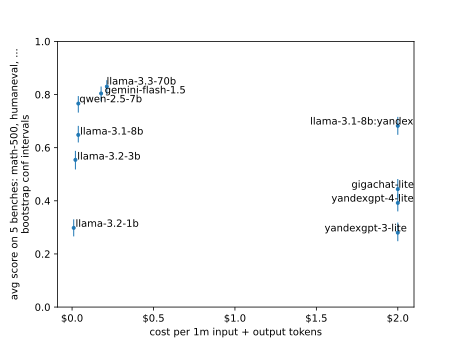

# simple-evals-ru

Репозиторий измеряет качество Yandexgpt и Gigachat на популярных англоязычных бенчмарках: Mgsm, Math, Humaneval, Mmlu-pro, Bbh.

- TODO Добавить Mbpp? Корр с Humaneval?
- TODO Добавить Gpqa
- TODO Добавить Ifeval, крайне заебисто проверять, не хочется тащить гугловый код
- TODO Добавить Arc-c? Корр с Mmlu / Gpqa?
- TODO Drop, Race, Hellaswag, Winograd, Piqa? Все про понимание языка, нет смысла мучать российские?

Репозиторий похож на <a href="https://github.com/openai/simple-evals">Simple-evals</a> от Openai:
- Упор на zeroshot. Не подбирать удобный промпт для каждой LLM.
- Упор на chain-of-thought. Не брать logprob первого токена, а просить рассуждать прежде чем дать ответ.
- Примитивный код, отчет с ошибками. Показывать какой промпт ушел в LLM, какой пришел ответ, почему защитал ошибку.
- Запросы к моделям только через API. Не запускает ничего на GPU.

.

- TODO Нормально ли гонять российские на англоязычных бенчах? Китайские братья же гоняют
- TODO Нормально что ответы к бенчам уже долго в паблике? Ну а что делать, считать что разрабы зайки и вычистили трейн
- TODO Что не так с Мера / SBS бенчами которые так любят Сбер и Яндекс. Почему бы просто не смотреть на русскую Арену?
- TODO Нюансы как отличаются данные который использую, от оригинальныз бенчей?
- TODO Нюансы как именно запускаю таски из бенчей, как именно проверяю ответ?
- TODO Описать как скорить свою модель с Runpod?

## Результаты

- Качество Yandexgpt/Gigachat-lite на уровне Llama-1/3b.
- Катастрофа с ценой за токен, российские модели в 20 раз дороже. Забавно что Яндекс, как бы понимая что Yandexgpt не оч, сервит рядом Llama-8b, но просит за нее в 20 раз больше чем Openrouter.
- У Llama-8b от Яндекса скор немного выше чем у Llama-8b от Openrouter, может быть квантизация более щадящая.
- У Yandexgpt-4-lite выше скор чем у Yandexgpt-3-lite, какой-то прогресс есть.




- TODO Прогнать Gigachat Pro / Max, Yandexgpt Pro. Как бы только при этом не разориться. Особенно на Max.
- TODO Прогнать TPro, TLite, Cotype, Saiga, Vikhr? Непонять только что для них считать ценой за токен.
- TODO Сравнить TPro, TLite, Cotype c Qwen, должно совпасть.
- TODO Побольше конечно прогнать с Openrouter. Только не ризонинг, их мне кажется надо сравнивать между собой

.

- TODO Попробовать прогнать русскоязычные аналоги Humaneval-ru, Mmlu-ru, ... Сравнить с англоязычными, гипотеза что скор будет примерно одинаковый
- TODO У российских моделей может быть очень крутой токенизатор для русского текста, сглаживает катастрофу с ценой за токен? Токенизировать правдоподобные тексты на русском и английском

.

- TODO Сравнить порядок моделей с другими бенчами: Арена, LLM leaderboard
- TODO Может быть поискать на какую модель из прошлого похожи Yandexgpt и Gigachat по скору/стоимости, прикинуть какое отставание
- TODO Упомянуть пиздец с доступом к Gigachat: сертификат от Минцифры, 1 запрос в секунду, ИП / договор / счет-фактура. Стойкое ощущение что нет цели сделать чтобы люди пользовались
- TODO Если такое низкое качество / высокий ценник / сложный доступ зачем это все вообще?

## Почитать ошибки

<section id="errors-table"><table>
<tr>
<th></th>
<th> mgsm-en </th>
<th> math-500 </th>
<th> humaneval </th>
<th> mmlu-pro-1k </th>
<th> bbh-1k </th>
</tr>
<tr>
<th> gigachat-lite </th>
<td> <a href="errors/mgsm/08_gigachat_lite.md"> 27 / 100 </a> </td>
<td> <a href="errors/math/08_gigachat_lite.md"> 73 / 100 </a> </td>
<td> <a href="errors/humaneval/08_gigachat_lite.md"> 62 / 100 </a> </td>
<td> <a href="errors/mmlu/08_gigachat_lite.md"> 64 / 100 </a> </td>
<td> <a href="errors/bbh/08_gigachat_lite.md"> 52 / 100 </a> </td>
</tr>
<tr>
<th> yandexgpt-4-lite </th>
<td> <a href="errors/mgsm/07_yandexgpt_4_lite.md"> 31 / 100 </a> </td>
<td> <a href="errors/math/07_yandexgpt_4_lite.md"> 85 / 100 </a> </td>
<td> <a href="errors/humaneval/07_yandexgpt_4_lite.md"> 69 / 100 </a> </td>
<td> <a href="errors/mmlu/07_yandexgpt_4_lite.md"> 75 / 100 </a> </td>
<td> <a href="errors/bbh/07_yandexgpt_4_lite.md"> 44 / 100 </a> </td>
</tr>
<tr>
<th> yandexgpt-3-lite </th>
<td> <a href="errors/mgsm/09_yandexgpt_3_lite.md"> 76 / 100 </a> </td>
<td> <a href="errors/math/09_yandexgpt_3_lite.md"> 86 / 100 </a> </td>
<td> <a href="errors/humaneval/09_yandexgpt_3_lite.md"> 75 / 100 </a> </td>
<td> <a href="errors/mmlu/09_yandexgpt_3_lite.md"> 65 / 100 </a> </td>
<td> <a href="errors/bbh/09_yandexgpt_3_lite.md"> 58 / 100 </a> </td>
</tr>
<tr>
<th> gemini-flash-1.5 </th>
<td> <a href="errors/mgsm/01_gemini_flash_1_5.md"> 8 / 100 </a> </td>
<td> <a href="errors/math/01_gemini_flash_1_5.md"> 17 / 100 </a> </td>
<td> <a href="errors/humaneval/01_gemini_flash_1_5.md"> 16 / 100 </a> </td>
<td> <a href="errors/mmlu/01_gemini_flash_1_5.md"> 31 / 100 </a> </td>
<td> <a href="errors/bbh/01_gemini_flash_1_5.md"> 26 / 100 </a> </td>
</tr>
<tr>
<th> llama-3.2-1b </th>
<td> <a href="errors/mgsm/02_llama_3_2_1b.md"> 57 / 100 </a> </td>
<td> <a href="errors/math/02_llama_3_2_1b.md"> 75 / 100 </a> </td>
<td> <a href="errors/humaneval/02_llama_3_2_1b.md"> 65 / 100 </a> </td>
<td> <a href="errors/mmlu/02_llama_3_2_1b.md"> 77 / 100 </a> </td>
<td> <a href="errors/bbh/02_llama_3_2_1b.md"> 77 / 100 </a> </td>
</tr>
<tr>
<th> llama-3.2-3b </th>
<td> <a href="errors/mgsm/03_llama_3_2_3b.md"> 18 / 100 </a> </td>
<td> <a href="errors/math/03_llama_3_2_3b.md"> 58 / 100 </a> </td>
<td> <a href="errors/humaneval/03_llama_3_2_3b.md"> 46 / 100 </a> </td>
<td> <a href="errors/mmlu/03_llama_3_2_3b.md"> 54 / 100 </a> </td>
<td> <a href="errors/bbh/03_llama_3_2_3b.md"> 47 / 100 </a> </td>
</tr>
<tr>
<th> llama-3.1-8b </th>
<td> <a href="errors/mgsm/04_llama_3_1_8b.md"> 13 / 100 </a> </td>
<td> <a href="errors/math/04_llama_3_1_8b.md"> 50 / 100 </a> </td>
<td> <a href="errors/humaneval/04_llama_3_1_8b.md"> 33 / 100 </a> </td>
<td> <a href="errors/mmlu/04_llama_3_1_8b.md"> 44 / 100 </a> </td>
<td> <a href="errors/bbh/04_llama_3_1_8b.md"> 36 / 100 </a> </td>
</tr>
<tr>
<th> llama-3.1-8b:yandex </th>
<td> <a href="errors/mgsm/10_llama_3_1_8b.md"> 16 / 99 </a> </td>
<td> <a href="errors/math/10_llama_3_1_8b.md"> 42 / 86 </a> </td>
<td> <a href="errors/humaneval/10_llama_3_1_8b.md"> 25 / 100 </a> </td>
<td> <a href="errors/mmlu/10_llama_3_1_8b.md"> 41 / 92 </a> </td>
<td> <a href="errors/bbh/10_llama_3_1_8b.md"> 27 / 98 </a> </td>
</tr>
<tr>
<th> llama-3.3-70b </th>
<td> <a href="errors/mgsm/05_llama_3_3_70b.md"> 6 / 100 </a> </td>
<td> <a href="errors/math/05_llama_3_3_70b.md"> 25 / 100 </a> </td>
<td> <a href="errors/humaneval/05_llama_3_3_70b.md"> 14 / 100 </a> </td>
<td> <a href="errors/mmlu/05_llama_3_3_70b.md"> 28 / 100 </a> </td>
<td> <a href="errors/bbh/05_llama_3_3_70b.md"> 12 / 100 </a> </td>
</tr>
<tr>
<th> qwen-2.5-7b </th>
<td> <a href="errors/mgsm/06_qwen_2_5_7b.md"> 10 / 100 </a> </td>
<td> <a href="errors/math/06_qwen_2_5_7b.md"> 26 / 100 </a> </td>
<td> <a href="errors/humaneval/06_qwen_2_5_7b.md"> 16 / 100 </a> </td>
<td> <a href="errors/mmlu/06_qwen_2_5_7b.md"> 41 / 100 </a> </td>
<td> <a href="errors/bbh/06_qwen_2_5_7b.md"> 24 / 100 </a> </td>
</tr>
</table>
</section>

## Вопросы и ответы

### "Очень странно что у вас модель Х выше чем модель У, я каждый день пользуюсь моделью У и уверен что она лучше чем модель Х"

### "А когда добавите модель Х?"

## Покрытие / сколько потратил

<section id="cov-table"><table>
<tr>
<th></th>
<th> mgsm-en, 250 </th>
<th> math-500, 500 </th>
<th> humaneval, 164 </th>
<th> mmlu-pro-1k, 1400 </th>
<th> bbh-1k, 1350 </th>
</tr>
<tr>
<th> gigachat-lite </th>
<td> 100 / 8.7¢ </td>
<td> 100 / 14.4¢ </td>
<td> 100 / 6.6¢ </td>
<td> 100 / 16.5¢ </td>
<td> 100 / 22.2¢ </td>
</tr>
<tr>
<th> yandexgpt-4-lite </th>
<td> 100 / 4.8¢ </td>
<td> 100 / 7.1¢ </td>
<td> 100 / 5.4¢ </td>
<td> 100 / 6.8¢ </td>
<td> 100 / 22.9¢ </td>
</tr>
<tr>
<th> yandexgpt-3-lite </th>
<td> 100 / 3.3¢ </td>
<td> 100 / 7.0¢ </td>
<td> 100 / 5.4¢ </td>
<td> 100 / 6.7¢ </td>
<td> 100 / 23.0¢ </td>
</tr>
<tr>
<th> gemini-flash-1.5 </th>
<td> 100 / 0.5¢ </td>
<td> 100 / 1.4¢ </td>
<td> 100 / 0.8¢ </td>
<td> 100 / 1.2¢ </td>
<td> 100 / 1.3¢ </td>
</tr>
<tr>
<th> llama-3.2-1b </th>
<td> 100 / 0.0¢ </td>
<td> 100 / 0.1¢ </td>
<td> 100 / 0.0¢ </td>
<td> 100 / 0.1¢ </td>
<td> 100 / 0.2¢ </td>
</tr>
<tr>
<th> llama-3.2-3b </th>
<td> 100 / 0.1¢ </td>
<td> 100 / 0.2¢ </td>
<td> 100 / 0.1¢ </td>
<td> 100 / 0.2¢ </td>
<td> 100 / 0.2¢ </td>
</tr>
<tr>
<th> llama-3.1-8b </th>
<td> 100 / 0.2¢ </td>
<td> 100 / 0.4¢ </td>
<td> 100 / 0.1¢ </td>
<td> 100 / 0.4¢ </td>
<td> 100 / 0.4¢ </td>
</tr>
<tr>
<th> llama-3.1-8b:yandex </th>
<td> 99 / 6.0¢ </td>
<td> 86 / 8.8¢ </td>
<td> 100 / 6.5¢ </td>
<td> 92 / 7.4¢ </td>
<td> 98 / 21.3¢ </td>
</tr>
<tr>
<th> llama-3.3-70b </th>
<td> 100 / 0.7¢ </td>
<td> 100 / 1.8¢ </td>
<td> 100 / 0.8¢ </td>
<td> 100 / 1.7¢ </td>
<td> 100 / 1.9¢ </td>
</tr>
<tr>
<th> qwen-2.5-7b </th>
<td> 100 / 0.2¢ </td>
<td> 100 / 0.3¢ </td>
<td> 100 / 0.1¢ </td>
<td> 100 / 0.3¢ </td>
<td> 100 / 0.4¢ </td>
</tr>
</table>
</section>

## Заметки для разработки

```
mkdir -p data/cache/mgsm
curl -o data/cache/mgsm/mgsm_en.tsv https://openaipublic.blob.core.windows.net/simple-evals/mgsm_en.tsv
uv run scripts/prep_benches.py -b mgsm
head -3 data/benches/mgsm.jsonl | jq .

mkdir -p data/cache/math
curl -o data/cache/math/math_test.csv https://openaipublic.blob.core.windows.net/simple-evals/math_test.csv
curl -o data/cache/math/math_500_test.csv https://openaipublic.blob.core.windows.net/simple-evals/math_500_test.csv
uv run scripts/prep_benches.py -b math
head -3 data/benches/math.jsonl | jq .

mkdir -p data/cache/humaneval
curl -L -o data/cache/humaneval/HumanEval.jsonl.gz https://github.com/openai/human-eval/raw/refs/heads/master/data/HumanEval.jsonl.gz
gunzip data/cache/humaneval/HumanEval.jsonl.gz
uv run scripts/prep_benches.py humaneval
head -3 data/benches/humaneval.jsonl | jq .

mkdir -p data/cache/mmlu
curl -L -o data/cache/mmlu/test-00000-of-00001.parquet https://huggingface.co/datasets/TIGER-Lab/MMLU-Pro/resolve/main/data/test-00000-of-00001.parquet
uv run scripts/prep_benches.py -b mmlu
head -3 data/benches/mmlu.jsonl | jq .

mkdir -p data/cache/simpleqa
curl -L -o data/cache/simpleqa/simple_qa_test_set.csv https://openaipublic.blob.core.windows.net/simple-evals/simple_qa_test_set.csv 
uv run scripts/prep_benches.py -b simpleqa
head -3 data/benches/simpleqa.jsonl | jq .

mkdir -p data/cache/bbh
curl -L -o data/cache/bbh/main.zip https://github.com/suzgunmirac/BIG-Bench-Hard/archive/refs/heads/main.zip
unzip -d data/cache/bbh data/cache/bbh/main.zip
uv run scripts/prep_benches.py -b bbh
head -3 data/benches/bbh.jsonl | jq .
```

```
uv run scripts/run_benches.py -k 1
uv run scripts/run_benches.py -k 100 -b{mgsm,math,mmlu,bbh}
```

```
rm -r errors
uv run scripts/report_errors.py
find errors -name '*.md' | grep giga | xargs cat | grip -

uv run scripts/readme_update.py
uv run scripts/plot_scatter_cost_score.py
```

```
export NO_COLOR=1
export PATH=/opt/homebrew/bin:$PATH
PROJ=~/proj/simple-evals-ru
. $PROJ/.envrc
uv run ruff check $(find $PROJ/simple $PROJ/scripts $PROJ/tests -name '*.py')n
uv run pytest -s $PROJ/tests/*.py
```

## Аппендикс J


