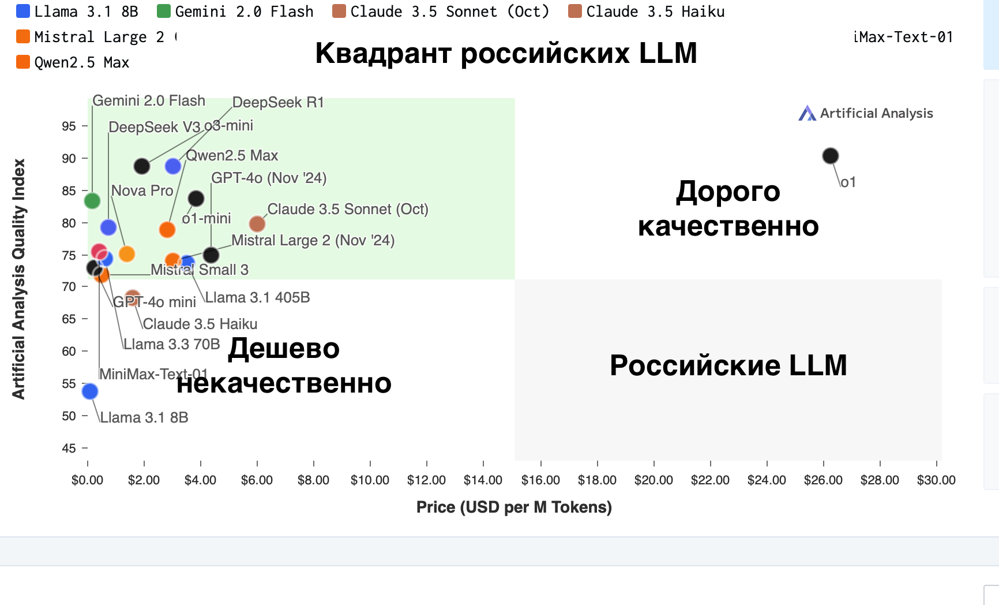
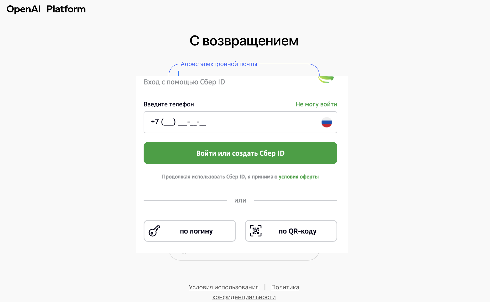

# simple-evals-ru

Репозиторий измеряет качество Yandexgpt и Gigachat на популярных англоязычных бенчмарках: MGSM, MATH, HumanEval, MMLU-Pro, BBH. В бенчмарках задания на математику, программирование и логику. Читать <a href="#samples">примеры заданий и ответы моделей</a>.

Репо похож на <a href="https://github.com/openai/simple-evals">simple-evals</a> от Openai, поддерживает только Intruct-модели, использует Zero-shot Chain-of-thought промпты, не подбирает удобные промпт каждой для модели.

> (!) Репо запускает российские LLM на англоязычных бенчмарках без перевода. Читать <a href="#eng_lang">аргументы, почему так норм делать</a>.

> (!) Репо использует популярные открытые бенчмарки, ответы на них давно есть в интернете. Читать <a href="#open_test">аргументы, почему норм использовать эти бенчмарки</a>.

## Результаты

Обязательная табличка со скорами. Рядом с названием модели цена за миллион токенов. "avg" - среднеарифметическое скоров по бенчмаркам.

<section id="scores-table"><table>
<tr>
<th></th>
<th>avg</th>
<th> mgsm-en </th>
<th> math-500 </th>
<th> humaneval </th>
<th> mmlu-pro-1k </th>
<th> bbh-1k </th>
</tr>
<tr>
<th> gigachat-lite, 2.00$ </th>
<td>43.9±5.4%</td>
<td>71.0±5.0%</td>
<td>27.3±5.1%</td>
<td>37.7±5.6%</td>
<td>34.3±5.6%</td>
<td>49.2±5.8%</td>
</tr>
<tr>
<th> gigachat-pro, 15.00$ </th>
<td>55.6±5.3%</td>
<td>78.5±4.5%</td>
<td>42.5±4.8%</td>
<td>45.1±6.7%</td>
<td>48.0±5.3%</td>
<td>64.0±4.8%</td>
</tr>
<tr>
<th> gigachat-max, 19.50$ </th>
<td>71.9±4.9%</td>
<td>93.5±2.8%</td>
<td>55.0±6.2%</td>
<td>72.0±5.5%</td>
<td>63.5±4.8%</td>
<td>75.5±4.5%</td>
</tr>
<tr>
<th> yandexgpt-4-lite, 2.00$ </th>
<td>38.4±5.2%</td>
<td>67.0±6.0%</td>
<td>16.0±3.5%</td>
<td>26.8±5.5%</td>
<td>27.0±5.5%</td>
<td>55.0±5.0%</td>
</tr>
<tr>
<th> yandexgpt-4-pro, 12.00$ </th>
<td>53.4±5.5%</td>
<td>78.5±5.3%</td>
<td>31.0±5.0%</td>
<td>42.7±5.8%</td>
<td>44.0±5.8%</td>
<td>71.0±5.8%</td>
</tr>
<tr>
<th> llama-3.1-8b, 0.04$ </th>
<td>61.2±5.4%</td>
<td>84.5±4.0%</td>
<td>45.5±5.0%</td>
<td>63.4±5.5%</td>
<td>54.0±6.7%</td>
<td>58.5±5.5%</td>
</tr>
<tr>
<th> llama-3.1-8b:yandex, 2.00$ </th>
<td>65.9±5.3%</td>
<td>85.4±3.9%</td>
<td>53.4±5.6%</td>
<td>70.1±6.4%</td>
<td>54.3±4.9%</td>
<td>66.3±5.4%</td>
</tr>
<tr>
<th> llama-3.3-70b, 0.21$ </th>
<td>83.8±4.0%</td>
<td>96.0±2.2%</td>
<td>75.0±5.0%</td>
<td>86.0±4.0%</td>
<td>74.5±4.3%</td>
<td>87.5±3.8%</td>
</tr>
<tr>
<th> llama-3.3-70b:yandex, 12.00$ </th>
<td>83.3±4.5%</td>
<td>96.0±1.8%</td>
<td>75.5±5.4%</td>
<td>84.1±4.9%</td>
<td>74.4±5.5%</td>
<td>86.5±3.8%</td>
</tr>
<tr>
<th> qwen-2.5-72b, 0.28$ </th>
<td>85.0±4.0%</td>
<td>96.5±2.5%</td>
<td>82.0±4.5%</td>
<td>88.4±3.7%</td>
<td>74.5±5.0%</td>
<td>83.5±3.8%</td>
</tr>
<tr>
<th> deepseek-v3, 0.68$ </th>
<td>87.8±3.8%</td>
<td>96.5±2.0%</td>
<td>83.0±4.7%</td>
<td>90.9±3.1%</td>
<td>79.5±4.6%</td>
<td>89.0±3.8%</td>
</tr>
</table>
</section>

Таблица картинкой, чтобы было проще разобраться:
- Яндекс, как бы признавая что Yandexgpt Lite и Pro оставляют желать лучшего, <a href="https://yandex.cloud/ru/docs/foundation-models/concepts/yandexgpt/models">продает в том же API Llama 8b и 70b</a>. С англоязычным заданиями Llama, конечно, справляется лучше российских LLM.
- Странновато выглядит Llama 8b между Yandexgpt Pro и Gigachat Max 🤷. В остальном картина ожидаемая: Lite < Pro < Max, Yandexgpt Lite ~ Gigachat Lite, Yangexgpt Pro ~ Gigachat Pro.


Поместим точки с предыдущего графика в мировой контекст, добавим Llama 8b/70b с Openrouter и популярные китайские Qwen/Deepseek:
- Катастрофа с ценой за токен. Яндекс продает свои Llama в ~50 раз дороже чем Openrouter. Llama 8b от Яндекса выше по скору Llama 8b от Openrouter, на Openrouter немного контуженная Llama, это хорошо видно на <a href="reports/errors/math/04_llama_3_1_8b.md">ответах 8b на MATH</a>, надо отобирать провайдеров которые сервят в fp16/bf16. Llama 70b идентичная по скору.
- Китайские модели на порядок дешевле и выше по скору на неродном английском языке. Пускай китайцы тренировали на тесте, пропасть по цене это не объясняет. Российские модели круто токенизируют русский текст, пускай токены в пять раз длинее на русском, это не компенсирует x50 разницу в цене.


<a name="samples"></a>
Таблица со ссылки на примеры заданий и ответы моделей:
- "X ✓" - ссылка на страничку с примерами когда модель угадала ответ, "Y ✗" - примеры где модель ошиблась. Полезно полистать ошибки, убедиться что репо правильно парсит ответы модели, случается что ответ правильный, но не по инструкции и репо защитал ошибку.
- Рядом с названием бенча число заданий, например, в MATH-500 500 заданий. Репо запускает не все задания, останавливается когда закончились деньги на API или доверительные интервалы уже достаточно узкие.

<section id="results-table"><table>
<tr>
<th></th>
<th> mgsm-en, 250 </th>
<th> math-500, 500 </th>
<th> humaneval, 164 </th>
<th> mmlu-pro-1k, 1400 </th>
<th> bbh-1k, 1350 </th>
</tr>
<tr>
<th> gigachat-lite </th>
<td> <a href="reports/correct/mgsm/08_gigachat_lite.md"> 142 ✓ </a> / <a href="reports/errors/mgsm/08_gigachat_lite.md"> 58 ✗</a> </td>
<td> <a href="reports/correct/math/08_gigachat_lite.md"> 54 ✓ </a> / <a href="reports/errors/math/08_gigachat_lite.md"> 144 ✗</a> </td>
<td> <a href="reports/correct/humaneval/08_gigachat_lite.md"> 61 ✓ </a> / <a href="reports/errors/humaneval/08_gigachat_lite.md"> 101 ✗</a> </td>
<td> <a href="reports/correct/mmlu/08_gigachat_lite.md"> 68 ✓ </a> / <a href="reports/errors/mmlu/08_gigachat_lite.md"> 130 ✗</a> </td>
<td> <a href="reports/correct/bbh/08_gigachat_lite.md"> 98 ✓ </a> / <a href="reports/errors/bbh/08_gigachat_lite.md"> 101 ✗</a> </td>
</tr>
<tr>
<th> gigachat-pro </th>
<td> <a href="reports/correct/mgsm/12_gigachat_pro.md"> 157 ✓ </a> / <a href="reports/errors/mgsm/12_gigachat_pro.md"> 43 ✗</a> </td>
<td> <a href="reports/correct/math/12_gigachat_pro.md"> 85 ✓ </a> / <a href="reports/errors/math/12_gigachat_pro.md"> 115 ✗</a> </td>
<td> <a href="reports/correct/humaneval/12_gigachat_pro.md"> 74 ✓ </a> / <a href="reports/errors/humaneval/12_gigachat_pro.md"> 90 ✗</a> </td>
<td> <a href="reports/correct/mmlu/12_gigachat_pro.md"> 96 ✓ </a> / <a href="reports/errors/mmlu/12_gigachat_pro.md"> 104 ✗</a> </td>
<td> <a href="reports/correct/bbh/12_gigachat_pro.md"> 128 ✓ </a> / <a href="reports/errors/bbh/12_gigachat_pro.md"> 72 ✗</a> </td>
</tr>
<tr>
<th> gigachat-max </th>
<td> <a href="reports/correct/mgsm/14_gigachat_max.md"> 187 ✓ </a> / <a href="reports/errors/mgsm/14_gigachat_max.md"> 13 ✗</a> </td>
<td> <a href="reports/correct/math/14_gigachat_max.md"> 110 ✓ </a> / <a href="reports/errors/math/14_gigachat_max.md"> 90 ✗</a> </td>
<td> <a href="reports/correct/humaneval/14_gigachat_max.md"> 118 ✓ </a> / <a href="reports/errors/humaneval/14_gigachat_max.md"> 46 ✗</a> </td>
<td> <a href="reports/correct/mmlu/14_gigachat_max.md"> 127 ✓ </a> / <a href="reports/errors/mmlu/14_gigachat_max.md"> 73 ✗</a> </td>
<td> <a href="reports/correct/bbh/14_gigachat_max.md"> 151 ✓ </a> / <a href="reports/errors/bbh/14_gigachat_max.md"> 49 ✗</a> </td>
</tr>
<tr>
<th> yandexgpt-4-lite </th>
<td> <a href="reports/correct/mgsm/07_yandexgpt_4_lite.md"> 134 ✓ </a> / <a href="reports/errors/mgsm/07_yandexgpt_4_lite.md"> 66 ✗</a> </td>
<td> <a href="reports/correct/math/07_yandexgpt_4_lite.md"> 32 ✓ </a> / <a href="reports/errors/math/07_yandexgpt_4_lite.md"> 168 ✗</a> </td>
<td> <a href="reports/correct/humaneval/07_yandexgpt_4_lite.md"> 44 ✓ </a> / <a href="reports/errors/humaneval/07_yandexgpt_4_lite.md"> 120 ✗</a> </td>
<td> <a href="reports/correct/mmlu/07_yandexgpt_4_lite.md"> 54 ✓ </a> / <a href="reports/errors/mmlu/07_yandexgpt_4_lite.md"> 146 ✗</a> </td>
<td> <a href="reports/correct/bbh/07_yandexgpt_4_lite.md"> 110 ✓ </a> / <a href="reports/errors/bbh/07_yandexgpt_4_lite.md"> 90 ✗</a> </td>
</tr>
<tr>
<th> yandexgpt-4-pro </th>
<td> <a href="reports/correct/mgsm/11_yandexgpt_4_pro.md"> 157 ✓ </a> / <a href="reports/errors/mgsm/11_yandexgpt_4_pro.md"> 43 ✗</a> </td>
<td> <a href="reports/correct/math/11_yandexgpt_4_pro.md"> 62 ✓ </a> / <a href="reports/errors/math/11_yandexgpt_4_pro.md"> 138 ✗</a> </td>
<td> <a href="reports/correct/humaneval/11_yandexgpt_4_pro.md"> 70 ✓ </a> / <a href="reports/errors/humaneval/11_yandexgpt_4_pro.md"> 94 ✗</a> </td>
<td> <a href="reports/correct/mmlu/11_yandexgpt_4_pro.md"> 88 ✓ </a> / <a href="reports/errors/mmlu/11_yandexgpt_4_pro.md"> 112 ✗</a> </td>
<td> <a href="reports/correct/bbh/11_yandexgpt_4_pro.md"> 142 ✓ </a> / <a href="reports/errors/bbh/11_yandexgpt_4_pro.md"> 58 ✗</a> </td>
</tr>
<tr>
<th> llama-3.1-8b </th>
<td> <a href="reports/correct/mgsm/04_llama_3_1_8b.md"> 169 ✓ </a> / <a href="reports/errors/mgsm/04_llama_3_1_8b.md"> 31 ✗</a> </td>
<td> <a href="reports/correct/math/04_llama_3_1_8b.md"> 91 ✓ </a> / <a href="reports/errors/math/04_llama_3_1_8b.md"> 109 ✗</a> </td>
<td> <a href="reports/correct/humaneval/04_llama_3_1_8b.md"> 104 ✓ </a> / <a href="reports/errors/humaneval/04_llama_3_1_8b.md"> 60 ✗</a> </td>
<td> <a href="reports/correct/mmlu/04_llama_3_1_8b.md"> 108 ✓ </a> / <a href="reports/errors/mmlu/04_llama_3_1_8b.md"> 92 ✗</a> </td>
<td> <a href="reports/correct/bbh/04_llama_3_1_8b.md"> 117 ✓ </a> / <a href="reports/errors/bbh/04_llama_3_1_8b.md"> 83 ✗</a> </td>
</tr>
<tr>
<th> llama-3.1-8b:yandex </th>
<td> <a href="reports/correct/mgsm/10_llama_3_1_8b.md"> 164 ✓ </a> / <a href="reports/errors/mgsm/10_llama_3_1_8b.md"> 28 ✗</a> </td>
<td> <a href="reports/correct/math/10_llama_3_1_8b.md"> 95 ✓ </a> / <a href="reports/errors/math/10_llama_3_1_8b.md"> 83 ✗</a> </td>
<td> <a href="reports/correct/humaneval/10_llama_3_1_8b.md"> 115 ✓ </a> / <a href="reports/errors/humaneval/10_llama_3_1_8b.md"> 49 ✗</a> </td>
<td> <a href="reports/correct/mmlu/10_llama_3_1_8b.md"> 100 ✓ </a> / <a href="reports/errors/mmlu/10_llama_3_1_8b.md"> 84 ✗</a> </td>
<td> <a href="reports/correct/bbh/10_llama_3_1_8b.md"> 130 ✓ </a> / <a href="reports/errors/bbh/10_llama_3_1_8b.md"> 66 ✗</a> </td>
</tr>
<tr>
<th> llama-3.3-70b </th>
<td> <a href="reports/correct/mgsm/05_llama_3_3_70b.md"> 192 ✓ </a> / <a href="reports/errors/mgsm/05_llama_3_3_70b.md"> 8 ✗</a> </td>
<td> <a href="reports/correct/math/05_llama_3_3_70b.md"> 150 ✓ </a> / <a href="reports/errors/math/05_llama_3_3_70b.md"> 50 ✗</a> </td>
<td> <a href="reports/correct/humaneval/05_llama_3_3_70b.md"> 141 ✓ </a> / <a href="reports/errors/humaneval/05_llama_3_3_70b.md"> 23 ✗</a> </td>
<td> <a href="reports/correct/mmlu/05_llama_3_3_70b.md"> 149 ✓ </a> / <a href="reports/errors/mmlu/05_llama_3_3_70b.md"> 51 ✗</a> </td>
<td> <a href="reports/correct/bbh/05_llama_3_3_70b.md"> 175 ✓ </a> / <a href="reports/errors/bbh/05_llama_3_3_70b.md"> 25 ✗</a> </td>
</tr>
<tr>
<th> llama-3.3-70b:yandex </th>
<td> <a href="reports/correct/mgsm/13_llama_3_3_70b.md"> 192 ✓ </a> / <a href="reports/errors/mgsm/13_llama_3_3_70b.md"> 8 ✗</a> </td>
<td> <a href="reports/correct/math/13_llama_3_3_70b.md"> 148 ✓ </a> / <a href="reports/errors/math/13_llama_3_3_70b.md"> 48 ✗</a> </td>
<td> <a href="reports/correct/humaneval/13_llama_3_3_70b.md"> 138 ✓ </a> / <a href="reports/errors/humaneval/13_llama_3_3_70b.md"> 26 ✗</a> </td>
<td> <a href="reports/correct/mmlu/13_llama_3_3_70b.md"> 148 ✓ </a> / <a href="reports/errors/mmlu/13_llama_3_3_70b.md"> 51 ✗</a> </td>
<td> <a href="reports/correct/bbh/13_llama_3_3_70b.md"> 173 ✓ </a> / <a href="reports/errors/bbh/13_llama_3_3_70b.md"> 27 ✗</a> </td>
</tr>
<tr>
<th> qwen-2.5-72b </th>
<td> <a href="reports/correct/mgsm/15_qwen_2_5_72b.md"> 193 ✓ </a> / <a href="reports/errors/mgsm/15_qwen_2_5_72b.md"> 7 ✗</a> </td>
<td> <a href="reports/correct/math/15_qwen_2_5_72b.md"> 164 ✓ </a> / <a href="reports/errors/math/15_qwen_2_5_72b.md"> 36 ✗</a> </td>
<td> <a href="reports/correct/humaneval/15_qwen_2_5_72b.md"> 145 ✓ </a> / <a href="reports/errors/humaneval/15_qwen_2_5_72b.md"> 19 ✗</a> </td>
<td> <a href="reports/correct/mmlu/15_qwen_2_5_72b.md"> 149 ✓ </a> / <a href="reports/errors/mmlu/15_qwen_2_5_72b.md"> 51 ✗</a> </td>
<td> <a href="reports/correct/bbh/15_qwen_2_5_72b.md"> 167 ✓ </a> / <a href="reports/errors/bbh/15_qwen_2_5_72b.md"> 33 ✗</a> </td>
</tr>
<tr>
<th> deepseek-v3 </th>
<td> <a href="reports/correct/mgsm/16_deepseek_v3.md"> 193 ✓ </a> / <a href="reports/errors/mgsm/16_deepseek_v3.md"> 7 ✗</a> </td>
<td> <a href="reports/correct/math/16_deepseek_v3.md"> 151 ✓ </a> / <a href="reports/errors/math/16_deepseek_v3.md"> 31 ✗</a> </td>
<td> <a href="reports/correct/humaneval/16_deepseek_v3.md"> 149 ✓ </a> / <a href="reports/errors/humaneval/16_deepseek_v3.md"> 15 ✗</a> </td>
<td> <a href="reports/correct/mmlu/16_deepseek_v3.md"> 155 ✓ </a> / <a href="reports/errors/mmlu/16_deepseek_v3.md"> 40 ✗</a> </td>
<td> <a href="reports/correct/bbh/16_deepseek_v3.md"> 178 ✓ </a> / <a href="reports/errors/bbh/16_deepseek_v3.md"> 22 ✗</a> </td>
</tr>
</table>
</section>

Здесь необходимо поныть, как непросто собрать ответы от российских LLM:
- Яндекс <a href="https://yandex.cloud/ru/docs/foundation-models/concepts/limits#yandexgpt-quotas">щедро разрешает десять параллельных запросов к API</a>, не десять запросов в секунду а десять параллельных запросов в любой момент времени. Если модель рассуждая отвечает 10 секунд, получаем 1 запрос в секунду. 20 заданий из MATH ломают Llama 8b от Яндекса, в ответ на них всегда приходит GatewayTimeout.
- Gigachat надежно защищен авторизаций по Сбер ID, чтобы иностранный гражданин не получил доступ к отечественному ИИ. Для дополнительной защиты <a href="https://developers.sber.ru/docs/ru/gigachat/certificates">Сбер просит подписывать запросы к Gigachat сертификатом Минцифры</a>. Сбер сделал <a href="https://developers.sber.ru/docs/ru/gigachat/api/compatible-openai">вариант API совместимы с Openai</a>, но вместо ключа просит оправлять токен, который протухает раз в полчаса. Для физлиц Сбер разрешает один параллельный запрос к API, не один запров в секунду, а один параллельный запрос в любой момент времени. Чтобы делать сумасшедшие десять параллельных запросов, Сбер попросит завести юрлицо в России, <a href="https://developers.sber.ru/docs/ru/gigachat/quickstart/legal-tokens-purchase#oplata-po-dogovoru">оплатить счет-оферту или подписать договор</a>.

## Вопросы и ответы

<a href="eng_lang"></a>
### Почему вы запускаете российские LLM на англоязычных бенчмарках?

- Апелляция к авторитету. Топовые китайские Qwen и Deepseek, демонстрируют в первую очередь результаты на англоязычных бенчмарках и только во вторую на китайских: https://arxiv.org/abs/2309.16609, https://arxiv.org/abs/2412.19437.
- Сбер в своих статьях на Хабре в 2024 году среди прочих скоров публикует результаты на англоязычных бенчах: https://habr.com/ru/companies/sberdevices/articles/780334/, https://habr.com/ru/companies/sberdevices/articles/855368/, https://habr.com/ru/companies/sberdevices/articles/865996/.
- Репо использует англоязычные бенчи с заданиями про математику, программирование и логику, там нет заданий про знание языка и культуры. Читать <a href="#samples">примеры заданий</a>.
- Современные версии Yandexgpt и Gigachat способны понимать вопрос на английском и отвечать на английском. Читать <a href="#samples">примеры ответов</a>.

<a href="open_test"></a>
### А ничего что ответы на эти бенчмарки давно есть в интернете?

- Апелляция к авторитету. Авторы топовых LLM в 2024 году публиковали результаты на этих бенчах: https://arxiv.org/pdf/2407.21783, https://arxiv.org/pdf/2412.15115, https://arxiv.org/pdf/2412.19437
- Верю что разработчики в Сбере/Яндексе зайки и вычистили трейн. Бенчи супер популярные, команды точно про них знают. По-хорошему 
https://arxiv.org/abs/2405.00332v1

<a href="compare_benches"></a>
### Зачем еще один бенчмарка когда есть MERA и российская LLM Arena?

...

### Очень странно что у вас модель Х выше чем модель У, я каждый день пользуюсь моделью У и уверен что она лучше чем модель Х

...

### А когда добавите модель Х?

...


## Заметки для разработки

- [ ] Добавить Mbpp? Коррелирует с Humaneval?
- [ ] Добавить Gpqa
- [ ] Добавить Ifeval, крайне заебисто проверять, не хочется тащить гугловый код
- [ ] Добавить Arc-c? Коррелирует с Mmlu / Gpqa?
- [ ] Drop, Race, Hellaswag, Winograd, Piqa? Все про понимание языка, нет смысла мучать российские?

- [ ] Нюансы как отличаются данные который использую, от оригинальных бенчей?
- [ ] Нюансы как именно запускаю таски из бенчей, как именно проверяю ответ?
- [ ] Описать как скорить свою модель с Runpod?

- [ ] Прогнать TPro, TLite, Cotype, Saiga, Vikhr? Непонять только что для них считать ценой за токен.
- [ ] Сравнить TPro, TLite, Cotype c Qwen, должно совпасть.


- [ ] Попробовать прогнать русскоязычные аналоги Humaneval-ru, Mmlu-ru, ... Сравнить с англоязычными, гипотеза что скор будет примерно одинаковый
- [ ] У российских моделей может быть очень крутой токенизатор для русского текста, сглаживает катастрофу с ценой за токен? Токенизировать правдоподобные тексты на русском и английском

- [ ] Сравнить порядок моделей с другими бенчами: Арена, LLM leaderboard
- [ ] Может быть поискать на какую модель из прошлого похожи Yandexgpt и Gigachat по скору/стоимости, прикинуть какое отставание
- [ ] Если такое низкое качество / высокий ценник / сложный доступ зачем это все вообще?

<section id="cov-table"><table>
<tr>
<th></th>
<th> mgsm-en, 250 </th>
<th> math-500, 500 </th>
<th> humaneval, 164 </th>
<th> mmlu-pro-1k, 1400 </th>
<th> bbh-1k, 1350 </th>
</tr>
<tr>
<th> gigachat-lite </th>
<td> 200 / 0.2$ </td>
<td> 198 / 0.3$ </td>
<td> 162 / 0.1$ </td>
<td> 198 / 0.3$ </td>
<td> 199 / 0.5$ </td>
</tr>
<tr>
<th> gigachat-pro </th>
<td> 200 / 1.2$ </td>
<td> 200 / 2.0$ </td>
<td> 164 / 0.8$ </td>
<td> 200 / 2.5$ </td>
<td> 200 / 3.8$ </td>
</tr>
<tr>
<th> gigachat-max </th>
<td> 200 / 1.0$ </td>
<td> 200 / 2.2$ </td>
<td> 164 / 0.8$ </td>
<td> 200 / 2.3$ </td>
<td> 200 / 4.3$ </td>
</tr>
<tr>
<th> yandexgpt-4-lite </th>
<td> 200 / 0.1$ </td>
<td> 200 / 0.1$ </td>
<td> 164 / 0.1$ </td>
<td> 200 / 0.1$ </td>
<td> 200 / 0.5$ </td>
</tr>
<tr>
<th> yandexgpt-4-pro </th>
<td> 200 / 0.6$ </td>
<td> 200 / 1.1$ </td>
<td> 164 / 0.6$ </td>
<td> 200 / 1.0$ </td>
<td> 200 / 2.8$ </td>
</tr>
<tr>
<th> llama-3.1-8b </th>
<td> 200 / 0.0$ </td>
<td> 200 / 0.0$ </td>
<td> 164 / 0.0$ </td>
<td> 200 / 0.0$ </td>
<td> 200 / 0.0$ </td>
</tr>
<tr>
<th> llama-3.1-8b:yandex </th>
<td> 192 / 0.1$ </td>
<td> 178 / 0.2$ </td>
<td> 164 / 0.1$ </td>
<td> 184 / 0.2$ </td>
<td> 196 / 0.4$ </td>
</tr>
<tr>
<th> llama-3.3-70b </th>
<td> 200 / 0.0$ </td>
<td> 200 / 0.0$ </td>
<td> 164 / 0.0$ </td>
<td> 200 / 0.0$ </td>
<td> 200 / 0.0$ </td>
</tr>
<tr>
<th> llama-3.3-70b:yandex </th>
<td> 200 / 0.7$ </td>
<td> 196 / 1.7$ </td>
<td> 164 / 0.7$ </td>
<td> 199 / 1.8$ </td>
<td> 200 / 2.9$ </td>
</tr>
<tr>
<th> qwen-2.5-72b </th>
<td> 200 / 0.0$ </td>
<td> 200 / 0.1$ </td>
<td> 164 / 0.0$ </td>
<td> 200 / 0.1$ </td>
<td> 200 / 0.0$ </td>
</tr>
<tr>
<th> deepseek-v3 </th>
<td> 200 / 0.0$ </td>
<td> 182 / 0.1$ </td>
<td> 164 / 0.0$ </td>
<td> 195 / 0.1$ </td>
<td> 200 / 0.1$ </td>
</tr>
</table>
</section>

```
mkdir -p data/cache/mgsm
curl -o data/cache/mgsm/mgsm_en.tsv https://openaipublic.blob.core.windows.net/simple-evals/mgsm_en.tsv
uv run scripts/prep_benches.py -b mgsm
head -3 data/benches/mgsm.jsonl | jq .

mkdir -p data/cache/math
curl -o data/cache/math/math_test.csv https://openaipublic.blob.core.windows.net/simple-evals/math_test.csv
curl -o data/cache/math/math_500_test.csv https://openaipublic.blob.core.windows.net/simple-evals/math_500_test.csv
uv run scripts/prep_benches.py -b math
head -3 data/benches/math.jsonl | jq .

mkdir -p data/cache/humaneval
curl -L -o data/cache/humaneval/HumanEval.jsonl.gz https://github.com/openai/human-eval/raw/refs/heads/master/data/HumanEval.jsonl.gz
gunzip data/cache/humaneval/HumanEval.jsonl.gz
uv run scripts/prep_benches.py humaneval
head -3 data/benches/humaneval.jsonl | jq .

mkdir -p data/cache/mmlu
curl -L -o data/cache/mmlu/test-00000-of-00001.parquet https://huggingface.co/datasets/TIGER-Lab/MMLU-Pro/resolve/main/data/test-00000-of-00001.parquet
uv run scripts/prep_benches.py -b mmlu
head -3 data/benches/mmlu.jsonl | jq .

mkdir -p data/cache/simpleqa
curl -L -o data/cache/simpleqa/simple_qa_test_set.csv https://openaipublic.blob.core.windows.net/simple-evals/simple_qa_test_set.csv 
uv run scripts/prep_benches.py -b simpleqa
head -3 data/benches/simpleqa.jsonl | jq .

mkdir -p data/cache/bbh
curl -L -o data/cache/bbh/main.zip https://github.com/suzgunmirac/BIG-Bench-Hard/archive/refs/heads/main.zip
unzip -d data/cache/bbh data/cache/bbh/main.zip
uv run scripts/prep_benches.py -b bbh
head -3 data/benches/bbh.jsonl | jq .
```

```
uv run scripts/run_benches.py -k 1
uv run scripts/run_benches.py -k 100 -b{mgsm,math,mmlu,bbh}
uv run scripts/run_benches.py -k 200 -m{07_yandexgpt_4_lite,08_gigachat_lite,10_llama_3_1_8b,11_yandexgpt_4_pro,12_gigachat_pro,13_llama_3_3_70b,14_gigachat_max}
uv run scripts/run_benches.py -k 200 -m{08_gigachat_lite,12_gigachat_pro,14_gigachat_max}
uv run scripts/run_benches.py -k 200 -m{04_llama_3_1_8b,05_llama_3_3_70b,15_qwen_2_5_72b,16_deepseek_v3}
```

```
rm -r reports
uv run scripts/report_results.py
find errors -name '*.md' | grep giga | xargs cat | grip -

rm -r reports
uv run scripts/report_results.py
uv run scripts/readme_update.py

uv run scripts/plot_scatter_cost_score1.py
uv run scripts/plot_scatter_cost_score2.py
```

```
export NO_COLOR=1
export PATH=/opt/homebrew/bin:$PATH
PROJ=~/proj/simple-evals-ru
. $PROJ/.envrc
uv run ruff check $(find $PROJ/simple $PROJ/scripts $PROJ/tests -name '*.py')
uv run pytest -s $PROJ/tests/*.py
```

## Аппендикс J



