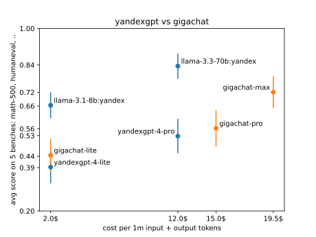
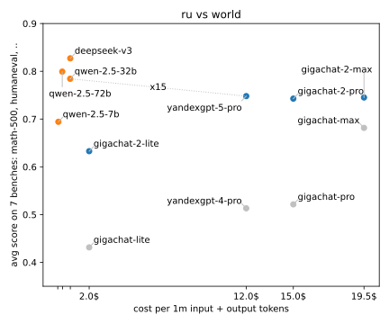

# simple-evals-ru

Репозиторий измеряет качество Yandexgpt, Gigachat и T-Pro на популярных англоязычных бенчмарках: MGSM, MATH, HumanEval, MMLU-Pro, BBH. В бенчмарках задания на математику, программирование и логику. Читать <a href="#samples">примеры заданий и ответы моделей</a>.

Репо сравнивает цену за миллион токенов для российских и популярных открытых мировых моделей: Llama, Qwen, Deepseek.

Репо похож на <a href="https://github.com/openai/simple-evals">simple-evals</a> от Openai, поддерживает только Intruct-модели, использует Zero-shot Chain-of-thought промпты, не подбирает удобный промпт для каждой модели.

> (!) Я запускаю российские LLM на англоязычных бенчмарках без перевода. Читать <a href="#eng_lang">аргументы, почему так норм делать</a>.

> (!) Я использую популярные открытые бенчмарки, ответы на них давно есть в интернете. Читать <a href="#open_test">аргументы, почему норм так делать</a>.

## Результаты

Обязательная табличка со скорами. Рядом с названием модели цена за миллион токенов. Для T-Pro цена приблизительная, я поделил чек от Runpod Serverless на число токенов. Спасибо, <a href="http://llmarena.ru">LLM Arena</a> за доступ к Runpod. Для Llama, Qwen и Deepseek цены с Openrouter.

<section id="scores-table"><table>
<tr>
<th></th>
<th>avg</th>
<th> mgsm-en </th>
<th> math-500 </th>
<th> humaneval </th>
<th> mmlu-pro-1k </th>
<th> bbh-1k </th>
</tr>
<tr>
<th> gigachat-lite, 2.00$ </th>
<td>44.2±5.5%</td>
<td>71.0±5.5%</td>
<td>27.3±4.8%</td>
<td>37.7±6.8%</td>
<td>36.0±5.0%</td>
<td>49.2±5.0%</td>
</tr>
<tr>
<th> gigachat-pro, 15.00$ </th>
<td>55.1±5.3%</td>
<td>78.5±4.7%</td>
<td>42.5±5.0%</td>
<td>45.1±6.1%</td>
<td>45.5±5.3%</td>
<td>64.0±5.0%</td>
</tr>
<tr>
<th> gigachat-max, 19.50$ </th>
<td>72.2±4.9%</td>
<td>93.5±2.7%</td>
<td>55.0±6.0%</td>
<td>72.0±5.2%</td>
<td>65.0±4.8%</td>
<td>75.5±5.3%</td>
</tr>
<tr>
<th> yandexgpt-4-lite, 2.00$ </th>
<td>39.1±5.2%</td>
<td>67.0±5.8%</td>
<td>16.0±3.3%</td>
<td>26.8±5.5%</td>
<td>30.5±5.0%</td>
<td>55.0±5.8%</td>
</tr>
<tr>
<th> yandexgpt-4-pro, 12.00$ </th>
<td>54.3±5.4%</td>
<td>78.5±4.5%</td>
<td>31.0±5.8%</td>
<td>42.7±6.1%</td>
<td>48.5±5.0%</td>
<td>71.0±5.3%</td>
</tr>
<tr>
<th> yandexgpt-5-pro, 12.00$ </th>
<td>78.9±4.5%</td>
<td>93.5±2.5%</td>
<td>57.5±5.5%</td>
<td>89.6±4.0%</td>
<td>70.0±5.8%</td>
<td>84.0±4.0%</td>
</tr>
<tr>
<th> llama-3.1-8b, 0.04$ </th>
<td>60.1±5.2%</td>
<td>84.5±3.5%</td>
<td>45.5±4.8%</td>
<td>63.4±5.8%</td>
<td>48.5±5.8%</td>
<td>58.5±5.8%</td>
</tr>
<tr>
<th> llama-3.1-8b:yandex, 2.00$ </th>
<td>63.7±5.0%</td>
<td>85.4±4.4%</td>
<td>48.0±4.8%</td>
<td>70.1±4.6%</td>
<td>48.5±5.5%</td>
<td>66.3±5.4%</td>
</tr>
<tr>
<th> llama-3.3-70b, 0.21$ </th>
<td>84.2±4.2%</td>
<td>96.0±2.0%</td>
<td>75.0±5.3%</td>
<td>86.0±4.0%</td>
<td>76.4±5.0%</td>
<td>87.5±3.8%</td>
</tr>
<tr>
<th> llama-3.3-70b:yandex, 12.00$ </th>
<td>83.2±4.3%</td>
<td>96.0±2.5%</td>
<td>74.0±4.8%</td>
<td>84.1±4.3%</td>
<td>75.5±5.3%</td>
<td>86.5±4.0%</td>
</tr>
<tr>
<th> qwen-2.5-72b, 0.28$ </th>
<td>84.9±3.8%</td>
<td>96.5±2.0%</td>
<td>82.0±4.0%</td>
<td>88.4±4.0%</td>
<td>74.0±4.8%</td>
<td>83.5±3.5%</td>
</tr>
<tr>
<th> deepseek-v3, 0.72$ </th>
<td>87.8±3.7%</td>
<td>96.5±2.0%</td>
<td>83.0±4.7%</td>
<td>90.9±3.7%</td>
<td>79.5±4.0%</td>
<td>89.0±3.5%</td>
</tr>
<tr>
<th> cotype-nano, 71.27$ </th>
<td>33.6±5.2%</td>
<td>15.5±3.8%</td>
<td>32.0±5.2%</td>
<td>52.4±6.2%</td>
<td>25.5±5.5%</td>
<td>42.5±5.0%</td>
</tr>
<tr>
<th> t-lite, 0.00$ </th>
<td>75.2±5.0%</td>
<td>91.0±3.5%</td>
<td>68.5±5.6%</td>
<td>82.3±5.4%</td>
<td>61.1±5.3%</td>
<td>73.4±5.1%</td>
</tr>
<tr>
<th> t-pro, 0.00$ </th>
<td>80.9±4.4%</td>
<td>95.0±2.5%</td>
<td>67.2±5.8%</td>
<td>85.4±4.1%</td>
<td>70.5±5.3%</td>
<td>86.5±3.5%</td>
</tr>
<tr>
<th> saiga-yandexgpt, 0.00$ </th>
<td>70.2±4.9%</td>
<td>88.5±3.5%</td>
<td>64.3±4.8%</td>
<td>73.8±4.9%</td>
<td>53.0±5.8%</td>
<td>71.5±5.0%</td>
</tr>
<tr>
<th> saiga-nemo, 0.00$ </th>
<td>59.4±5.5%</td>
<td>76.5±4.8%</td>
<td>38.2±6.3%</td>
<td>67.1±4.9%</td>
<td>46.5±5.3%</td>
<td>68.7±6.1%</td>
</tr>
<tr>
<th> vikhr-yandexgpt, 0.00$ </th>
<td>57.1±5.4%</td>
<td>34.0±5.0%</td>
<td>57.3±5.0%</td>
<td>73.8±5.8%</td>
<td>52.3±5.6%</td>
<td>68.2±5.6%</td>
</tr>
<tr>
<th> ruadapt-qwen, 0.00$ </th>
<td>82.7±4.4%</td>
<td>96.5±2.0%</td>
<td>73.5±5.3%</td>
<td>88.4±4.3%</td>
<td>70.4±5.6%</td>
<td>84.5±3.8%</td>
</tr>
</table>
</section>

Таблица картинкой, чтобы было проще разобраться:
- Яндекс <a href="https://habr.com/ru/companies/yandex/articles/885218/">перешел на претрен от Qwen</a> и обогнал Gigachat на англоязычных бенчмарках. Сбер остался в одиночестве с полностью отечественным претреном.
- T-Pro и Yandexgpt 5 Pro модели близнецы на одинаковом претрене Qwen 32b. T-Pro на Runpod Serverless дешевле, чем Yandexgpt в API. T-Pro рассуждает как будто охотнее чем Yandexgpt: <a href="reports/correct/mmlu/17_yandexgpt_5_pro.md">ответы на MMLU Yandexgpt</a> / <a href="reports/correct/mmlu/20_t_pro.md">ответы T-Pro</a>. T-Pro тренили от Instruct-версии? Т-Банк красавцы подхватили знамя Saiga / Vikhr.



Точки с предыдущего графика в мировом контексте:
- Катастрофа с ценой за токен. Яндекс в API для Yandexgpt <a href="https://yandex.cloud/ru/docs/foundation-models/concepts/yandexgpt/models">продает Llama 8b и 70b</a>, цена в ~50 раз выше чем у Llama с Openrouter. У яндексовой Llama 8b видимо мягче квантизация, скор повыше. Fireworks <a href="https://fireworks.ai/pricing">продает 16b+ модели по доллару за миллион токенов</a>, Яндекс и Сбер на порядок дороже.
- Китайские модели дешевле и выше по скору на неродном английском языке. Пускай китайцы тренировали на тесте, пропасть по цене это не объясняет. Российские модели круто токенизируют русский текст, пускай токены в 2 раз длиннее на русском, это не компенсирует разницу в цене.
- Странно что ценник у Yandexgpt 5 Pro 32b и яндексовой Llama 70b одинаковый.



<a name="samples"></a>
Таблица со ссылками на примеры заданий и ответы моделей:
- "X ✓" - ссылка на страничку с примерами когда модель угадала ответ, "Y ✗" - примеры где модель ошиблась. Полезно полистать ошибки, убедиться что оценщик правильно парсит ответы модели, случается что ответ правильный, но не по инструкции и модель получает штраф.
- Рядом с названием бенча число заданий, например, в MATH-500 500 заданий. Репо запускает не все задания, останавливается, когда закончились деньги на API или доверительные интервалы уже достаточно узкие.

<section id="results-table"><table>
<tr>
<th></th>
<th> mgsm-en, 250 </th>
<th> math-500, 500 </th>
<th> humaneval, 164 </th>
<th> mmlu-pro-1k, 1400 </th>
<th> bbh-1k, 1350 </th>
</tr>
<tr>
<th> gigachat-lite </th>
<td> <a href="reports/correct/mgsm/08_gigachat_lite.md"> 142 ✓ </a> / <a href="reports/errors/mgsm/08_gigachat_lite.md"> 58 ✗</a> </td>
<td> <a href="reports/correct/math/08_gigachat_lite.md"> 54 ✓ </a> / <a href="reports/errors/math/08_gigachat_lite.md"> 144 ✗</a> </td>
<td> <a href="reports/correct/humaneval/08_gigachat_lite.md"> 61 ✓ </a> / <a href="reports/errors/humaneval/08_gigachat_lite.md"> 101 ✗</a> </td>
<td> <a href="reports/correct/mmlu/08_gigachat_lite.md"> 72 ✓ </a> / <a href="reports/errors/mmlu/08_gigachat_lite.md"> 128 ✗</a> </td>
<td> <a href="reports/correct/bbh/08_gigachat_lite.md"> 98 ✓ </a> / <a href="reports/errors/bbh/08_gigachat_lite.md"> 101 ✗</a> </td>
</tr>
<tr>
<th> gigachat-pro </th>
<td> <a href="reports/correct/mgsm/12_gigachat_pro.md"> 157 ✓ </a> / <a href="reports/errors/mgsm/12_gigachat_pro.md"> 43 ✗</a> </td>
<td> <a href="reports/correct/math/12_gigachat_pro.md"> 85 ✓ </a> / <a href="reports/errors/math/12_gigachat_pro.md"> 115 ✗</a> </td>
<td> <a href="reports/correct/humaneval/12_gigachat_pro.md"> 74 ✓ </a> / <a href="reports/errors/humaneval/12_gigachat_pro.md"> 90 ✗</a> </td>
<td> <a href="reports/correct/mmlu/12_gigachat_pro.md"> 91 ✓ </a> / <a href="reports/errors/mmlu/12_gigachat_pro.md"> 109 ✗</a> </td>
<td> <a href="reports/correct/bbh/12_gigachat_pro.md"> 128 ✓ </a> / <a href="reports/errors/bbh/12_gigachat_pro.md"> 72 ✗</a> </td>
</tr>
<tr>
<th> gigachat-max </th>
<td> <a href="reports/correct/mgsm/14_gigachat_max.md"> 187 ✓ </a> / <a href="reports/errors/mgsm/14_gigachat_max.md"> 13 ✗</a> </td>
<td> <a href="reports/correct/math/14_gigachat_max.md"> 110 ✓ </a> / <a href="reports/errors/math/14_gigachat_max.md"> 90 ✗</a> </td>
<td> <a href="reports/correct/humaneval/14_gigachat_max.md"> 118 ✓ </a> / <a href="reports/errors/humaneval/14_gigachat_max.md"> 46 ✗</a> </td>
<td> <a href="reports/correct/mmlu/14_gigachat_max.md"> 130 ✓ </a> / <a href="reports/errors/mmlu/14_gigachat_max.md"> 70 ✗</a> </td>
<td> <a href="reports/correct/bbh/14_gigachat_max.md"> 151 ✓ </a> / <a href="reports/errors/bbh/14_gigachat_max.md"> 49 ✗</a> </td>
</tr>
<tr>
<th> yandexgpt-4-lite </th>
<td> <a href="reports/correct/mgsm/07_yandexgpt_4_lite.md"> 134 ✓ </a> / <a href="reports/errors/mgsm/07_yandexgpt_4_lite.md"> 66 ✗</a> </td>
<td> <a href="reports/correct/math/07_yandexgpt_4_lite.md"> 32 ✓ </a> / <a href="reports/errors/math/07_yandexgpt_4_lite.md"> 168 ✗</a> </td>
<td> <a href="reports/correct/humaneval/07_yandexgpt_4_lite.md"> 44 ✓ </a> / <a href="reports/errors/humaneval/07_yandexgpt_4_lite.md"> 120 ✗</a> </td>
<td> <a href="reports/correct/mmlu/07_yandexgpt_4_lite.md"> 61 ✓ </a> / <a href="reports/errors/mmlu/07_yandexgpt_4_lite.md"> 139 ✗</a> </td>
<td> <a href="reports/correct/bbh/07_yandexgpt_4_lite.md"> 110 ✓ </a> / <a href="reports/errors/bbh/07_yandexgpt_4_lite.md"> 90 ✗</a> </td>
</tr>
<tr>
<th> yandexgpt-4-pro </th>
<td> <a href="reports/correct/mgsm/11_yandexgpt_4_pro.md"> 157 ✓ </a> / <a href="reports/errors/mgsm/11_yandexgpt_4_pro.md"> 43 ✗</a> </td>
<td> <a href="reports/correct/math/11_yandexgpt_4_pro.md"> 62 ✓ </a> / <a href="reports/errors/math/11_yandexgpt_4_pro.md"> 138 ✗</a> </td>
<td> <a href="reports/correct/humaneval/11_yandexgpt_4_pro.md"> 70 ✓ </a> / <a href="reports/errors/humaneval/11_yandexgpt_4_pro.md"> 94 ✗</a> </td>
<td> <a href="reports/correct/mmlu/11_yandexgpt_4_pro.md"> 97 ✓ </a> / <a href="reports/errors/mmlu/11_yandexgpt_4_pro.md"> 103 ✗</a> </td>
<td> <a href="reports/correct/bbh/11_yandexgpt_4_pro.md"> 142 ✓ </a> / <a href="reports/errors/bbh/11_yandexgpt_4_pro.md"> 58 ✗</a> </td>
</tr>
<tr>
<th> yandexgpt-5-pro </th>
<td> <a href="reports/correct/mgsm/17_yandexgpt_5_pro.md"> 187 ✓ </a> / <a href="reports/errors/mgsm/17_yandexgpt_5_pro.md"> 13 ✗</a> </td>
<td> <a href="reports/correct/math/17_yandexgpt_5_pro.md"> 115 ✓ </a> / <a href="reports/errors/math/17_yandexgpt_5_pro.md"> 85 ✗</a> </td>
<td> <a href="reports/correct/humaneval/17_yandexgpt_5_pro.md"> 147 ✓ </a> / <a href="reports/errors/humaneval/17_yandexgpt_5_pro.md"> 17 ✗</a> </td>
<td> <a href="reports/correct/mmlu/17_yandexgpt_5_pro.md"> 140 ✓ </a> / <a href="reports/errors/mmlu/17_yandexgpt_5_pro.md"> 60 ✗</a> </td>
<td> <a href="reports/correct/bbh/17_yandexgpt_5_pro.md"> 168 ✓ </a> / <a href="reports/errors/bbh/17_yandexgpt_5_pro.md"> 32 ✗</a> </td>
</tr>
<tr>
<th> llama-3.1-8b </th>
<td> <a href="reports/correct/mgsm/04_llama_3_1_8b.md"> 169 ✓ </a> / <a href="reports/errors/mgsm/04_llama_3_1_8b.md"> 31 ✗</a> </td>
<td> <a href="reports/correct/math/04_llama_3_1_8b.md"> 91 ✓ </a> / <a href="reports/errors/math/04_llama_3_1_8b.md"> 109 ✗</a> </td>
<td> <a href="reports/correct/humaneval/04_llama_3_1_8b.md"> 104 ✓ </a> / <a href="reports/errors/humaneval/04_llama_3_1_8b.md"> 60 ✗</a> </td>
<td> <a href="reports/correct/mmlu/04_llama_3_1_8b.md"> 97 ✓ </a> / <a href="reports/errors/mmlu/04_llama_3_1_8b.md"> 103 ✗</a> </td>
<td> <a href="reports/correct/bbh/04_llama_3_1_8b.md"> 117 ✓ </a> / <a href="reports/errors/bbh/04_llama_3_1_8b.md"> 83 ✗</a> </td>
</tr>
<tr>
<th> llama-3.1-8b:yandex </th>
<td> <a href="reports/correct/mgsm/10_llama_3_1_8b.md"> 164 ✓ </a> / <a href="reports/errors/mgsm/10_llama_3_1_8b.md"> 28 ✗</a> </td>
<td> <a href="reports/correct/math/10_llama_3_1_8b.md"> 96 ✓ </a> / <a href="reports/errors/math/10_llama_3_1_8b.md"> 104 ✗</a> </td>
<td> <a href="reports/correct/humaneval/10_llama_3_1_8b.md"> 115 ✓ </a> / <a href="reports/errors/humaneval/10_llama_3_1_8b.md"> 49 ✗</a> </td>
<td> <a href="reports/correct/mmlu/10_llama_3_1_8b.md"> 97 ✓ </a> / <a href="reports/errors/mmlu/10_llama_3_1_8b.md"> 103 ✗</a> </td>
<td> <a href="reports/correct/bbh/10_llama_3_1_8b.md"> 130 ✓ </a> / <a href="reports/errors/bbh/10_llama_3_1_8b.md"> 66 ✗</a> </td>
</tr>
<tr>
<th> llama-3.3-70b </th>
<td> <a href="reports/correct/mgsm/05_llama_3_3_70b.md"> 192 ✓ </a> / <a href="reports/errors/mgsm/05_llama_3_3_70b.md"> 8 ✗</a> </td>
<td> <a href="reports/correct/math/05_llama_3_3_70b.md"> 150 ✓ </a> / <a href="reports/errors/math/05_llama_3_3_70b.md"> 50 ✗</a> </td>
<td> <a href="reports/correct/humaneval/05_llama_3_3_70b.md"> 141 ✓ </a> / <a href="reports/errors/humaneval/05_llama_3_3_70b.md"> 23 ✗</a> </td>
<td> <a href="reports/correct/mmlu/05_llama_3_3_70b.md"> 152 ✓ </a> / <a href="reports/errors/mmlu/05_llama_3_3_70b.md"> 47 ✗</a> </td>
<td> <a href="reports/correct/bbh/05_llama_3_3_70b.md"> 175 ✓ </a> / <a href="reports/errors/bbh/05_llama_3_3_70b.md"> 25 ✗</a> </td>
</tr>
<tr>
<th> llama-3.3-70b:yandex </th>
<td> <a href="reports/correct/mgsm/13_llama_3_3_70b.md"> 192 ✓ </a> / <a href="reports/errors/mgsm/13_llama_3_3_70b.md"> 8 ✗</a> </td>
<td> <a href="reports/correct/math/13_llama_3_3_70b.md"> 148 ✓ </a> / <a href="reports/errors/math/13_llama_3_3_70b.md"> 52 ✗</a> </td>
<td> <a href="reports/correct/humaneval/13_llama_3_3_70b.md"> 138 ✓ </a> / <a href="reports/errors/humaneval/13_llama_3_3_70b.md"> 26 ✗</a> </td>
<td> <a href="reports/correct/mmlu/13_llama_3_3_70b.md"> 151 ✓ </a> / <a href="reports/errors/mmlu/13_llama_3_3_70b.md"> 49 ✗</a> </td>
<td> <a href="reports/correct/bbh/13_llama_3_3_70b.md"> 173 ✓ </a> / <a href="reports/errors/bbh/13_llama_3_3_70b.md"> 27 ✗</a> </td>
</tr>
<tr>
<th> qwen-2.5-72b </th>
<td> <a href="reports/correct/mgsm/15_qwen_2_5_72b.md"> 193 ✓ </a> / <a href="reports/errors/mgsm/15_qwen_2_5_72b.md"> 7 ✗</a> </td>
<td> <a href="reports/correct/math/15_qwen_2_5_72b.md"> 164 ✓ </a> / <a href="reports/errors/math/15_qwen_2_5_72b.md"> 36 ✗</a> </td>
<td> <a href="reports/correct/humaneval/15_qwen_2_5_72b.md"> 145 ✓ </a> / <a href="reports/errors/humaneval/15_qwen_2_5_72b.md"> 19 ✗</a> </td>
<td> <a href="reports/correct/mmlu/15_qwen_2_5_72b.md"> 148 ✓ </a> / <a href="reports/errors/mmlu/15_qwen_2_5_72b.md"> 52 ✗</a> </td>
<td> <a href="reports/correct/bbh/15_qwen_2_5_72b.md"> 167 ✓ </a> / <a href="reports/errors/bbh/15_qwen_2_5_72b.md"> 33 ✗</a> </td>
</tr>
<tr>
<th> deepseek-v3 </th>
<td> <a href="reports/correct/mgsm/16_deepseek_v3.md"> 193 ✓ </a> / <a href="reports/errors/mgsm/16_deepseek_v3.md"> 7 ✗</a> </td>
<td> <a href="reports/correct/math/16_deepseek_v3.md"> 151 ✓ </a> / <a href="reports/errors/math/16_deepseek_v3.md"> 31 ✗</a> </td>
<td> <a href="reports/correct/humaneval/16_deepseek_v3.md"> 149 ✓ </a> / <a href="reports/errors/humaneval/16_deepseek_v3.md"> 15 ✗</a> </td>
<td> <a href="reports/correct/mmlu/16_deepseek_v3.md"> 159 ✓ </a> / <a href="reports/errors/mmlu/16_deepseek_v3.md"> 41 ✗</a> </td>
<td> <a href="reports/correct/bbh/16_deepseek_v3.md"> 178 ✓ </a> / <a href="reports/errors/bbh/16_deepseek_v3.md"> 22 ✗</a> </td>
</tr>
<tr>
<th> cotype-nano </th>
<td> <a href="reports/correct/mgsm/18_cotype_nano.md"> 31 ✓ </a> / <a href="reports/errors/mgsm/18_cotype_nano.md"> 169 ✗</a> </td>
<td> <a href="reports/correct/math/18_cotype_nano.md"> 64 ✓ </a> / <a href="reports/errors/math/18_cotype_nano.md"> 136 ✗</a> </td>
<td> <a href="reports/correct/humaneval/18_cotype_nano.md"> 86 ✓ </a> / <a href="reports/errors/humaneval/18_cotype_nano.md"> 78 ✗</a> </td>
<td> <a href="reports/correct/mmlu/18_cotype_nano.md"> 51 ✓ </a> / <a href="reports/errors/mmlu/18_cotype_nano.md"> 149 ✗</a> </td>
<td> <a href="reports/correct/bbh/18_cotype_nano.md"> 85 ✓ </a> / <a href="reports/errors/bbh/18_cotype_nano.md"> 115 ✗</a> </td>
</tr>
<tr>
<th> t-lite </th>
<td> <a href="reports/correct/mgsm/19_t_lite.md"> 182 ✓ </a> / <a href="reports/errors/mgsm/19_t_lite.md"> 18 ✗</a> </td>
<td> <a href="reports/correct/math/19_t_lite.md"> 135 ✓ </a> / <a href="reports/errors/math/19_t_lite.md"> 62 ✗</a> </td>
<td> <a href="reports/correct/humaneval/19_t_lite.md"> 130 ✓ </a> / <a href="reports/errors/humaneval/19_t_lite.md"> 28 ✗</a> </td>
<td> <a href="reports/correct/mmlu/19_t_lite.md"> 116 ✓ </a> / <a href="reports/errors/mmlu/19_t_lite.md"> 74 ✗</a> </td>
<td> <a href="reports/correct/bbh/19_t_lite.md"> 146 ✓ </a> / <a href="reports/errors/bbh/19_t_lite.md"> 53 ✗</a> </td>
</tr>
<tr>
<th> t-pro </th>
<td> <a href="reports/correct/mgsm/20_t_pro.md"> 190 ✓ </a> / <a href="reports/errors/mgsm/20_t_pro.md"> 10 ✗</a> </td>
<td> <a href="reports/correct/math/20_t_pro.md"> 129 ✓ </a> / <a href="reports/errors/math/20_t_pro.md"> 63 ✗</a> </td>
<td> <a href="reports/correct/humaneval/20_t_pro.md"> 135 ✓ </a> / <a href="reports/errors/humaneval/20_t_pro.md"> 23 ✗</a> </td>
<td> <a href="reports/correct/mmlu/20_t_pro.md"> 141 ✓ </a> / <a href="reports/errors/mmlu/20_t_pro.md"> 59 ✗</a> </td>
<td> <a href="reports/correct/bbh/20_t_pro.md"> 173 ✓ </a> / <a href="reports/errors/bbh/20_t_pro.md"> 27 ✗</a> </td>
</tr>
<tr>
<th> saiga-yandexgpt </th>
<td> <a href="reports/correct/mgsm/21_saiga.md"> 177 ✓ </a> / <a href="reports/errors/mgsm/21_saiga.md"> 23 ✗</a> </td>
<td> <a href="reports/correct/math/21_saiga.md"> 128 ✓ </a> / <a href="reports/errors/math/21_saiga.md"> 71 ✗</a> </td>
<td> <a href="reports/correct/humaneval/21_saiga.md"> 121 ✓ </a> / <a href="reports/errors/humaneval/21_saiga.md"> 43 ✗</a> </td>
<td> <a href="reports/correct/mmlu/21_saiga.md"> 106 ✓ </a> / <a href="reports/errors/mmlu/21_saiga.md"> 94 ✗</a> </td>
<td> <a href="reports/correct/bbh/21_saiga.md"> 143 ✓ </a> / <a href="reports/errors/bbh/21_saiga.md"> 57 ✗</a> </td>
</tr>
<tr>
<th> saiga-nemo </th>
<td> <a href="reports/correct/mgsm/23_saiga.md"> 153 ✓ </a> / <a href="reports/errors/mgsm/23_saiga.md"> 47 ✗</a> </td>
<td> <a href="reports/correct/math/23_saiga.md"> 76 ✓ </a> / <a href="reports/errors/math/23_saiga.md"> 123 ✗</a> </td>
<td> <a href="reports/correct/humaneval/23_saiga.md"> 110 ✓ </a> / <a href="reports/errors/humaneval/23_saiga.md"> 54 ✗</a> </td>
<td> <a href="reports/correct/mmlu/23_saiga.md"> 92 ✓ </a> / <a href="reports/errors/mmlu/23_saiga.md"> 106 ✗</a> </td>
<td> <a href="reports/correct/bbh/23_saiga.md"> 136 ✓ </a> / <a href="reports/errors/bbh/23_saiga.md"> 62 ✗</a> </td>
</tr>
<tr>
<th> vikhr-yandexgpt </th>
<td> <a href="reports/correct/mgsm/22_vikhr.md"> 68 ✓ </a> / <a href="reports/errors/mgsm/22_vikhr.md"> 132 ✗</a> </td>
<td> <a href="reports/correct/math/22_vikhr.md"> 114 ✓ </a> / <a href="reports/errors/math/22_vikhr.md"> 85 ✗</a> </td>
<td> <a href="reports/correct/humaneval/22_vikhr.md"> 121 ✓ </a> / <a href="reports/errors/humaneval/22_vikhr.md"> 43 ✗</a> </td>
<td> <a href="reports/correct/mmlu/22_vikhr.md"> 104 ✓ </a> / <a href="reports/errors/mmlu/22_vikhr.md"> 95 ✗</a> </td>
<td> <a href="reports/correct/bbh/22_vikhr.md"> 135 ✓ </a> / <a href="reports/errors/bbh/22_vikhr.md"> 63 ✗</a> </td>
</tr>
<tr>
<th> ruadapt-qwen </th>
<td> <a href="reports/correct/mgsm/24_ruadapt.md"> 193 ✓ </a> / <a href="reports/errors/mgsm/24_ruadapt.md"> 7 ✗</a> </td>
<td> <a href="reports/correct/math/24_ruadapt.md"> 147 ✓ </a> / <a href="reports/errors/math/24_ruadapt.md"> 53 ✗</a> </td>
<td> <a href="reports/correct/humaneval/24_ruadapt.md"> 145 ✓ </a> / <a href="reports/errors/humaneval/24_ruadapt.md"> 19 ✗</a> </td>
<td> <a href="reports/correct/mmlu/24_ruadapt.md"> 140 ✓ </a> / <a href="reports/errors/mmlu/24_ruadapt.md"> 59 ✗</a> </td>
<td> <a href="reports/correct/bbh/24_ruadapt.md"> 169 ✓ </a> / <a href="reports/errors/bbh/24_ruadapt.md"> 31 ✗</a> </td>
</tr>
</table>
</section>

Здесь необходимо поныть как непросто собрать ответы от российских LLM:
- Яндекс <a href="https://yandex.cloud/ru/docs/foundation-models/concepts/limits#yandexgpt-quotas">щедро разрешает десять параллельных запросов к API</a>, не десять запросов в секунду а десять параллельных запросов в любой момент времени. Если модель рассуждая отвечает 10 секунд, получаем 1 запрос в секунду.
- Для физлиц Сбер разрешает только последовательные запросы. Чтобы делать сумасшедшие десять параллельных запросов, Сбер попросит завести юрлицо в России, <a href="https://developers.sber.ru/docs/ru/gigachat/quickstart/legal-tokens-purchase#oplata-po-dogovoru">оплатить счет-оферту или подписать договор</a>. Gigachat надежно защищен авторизаций по Сбер ID, и <a href="https://developers.sber.ru/docs/ru/gigachat/certificates">сертификатом от Минцифры</a>. У Gigachat есть <a href="https://developers.sber.ru/docs/ru/gigachat/api/compatible-openai">вариант API совместимы с Openai</a>, но вместо ключа там токен, который протухает раз в полчаса. 

Видимо, Yandexgpt / Gigachat API целится в узкую аудиторию: компании, которые готовы отправлять данные за корпоративный контур, но не готовы отправлять их за пределы России. Задачи конкурировать с мировыми решениями, видимо, нет.

## Вопросы и ответы

<a name="eng_lang"></a>
### Почему вы запускаете российские LLM на англоязычных бенчмарках?

- Апелляция к авторитету. Топовые китайские Qwen и Deepseek, демонстрируют в первую очередь результаты на англоязычных бенчмарках и только во вторую на китайских: https://arxiv.org/abs/2309.16609, https://arxiv.org/abs/2412.19437.
- Сбер в своих статьях на Хабре в 2024 году среди прочих результатов публикует скоры на англоязычных бенчах: https://habr.com/ru/companies/sberdevices/articles/780334/, https://habr.com/ru/companies/sberdevices/articles/855368/, https://habr.com/ru/companies/sberdevices/articles/865996/. Яндекс в 2025 публикует результаты на англоязычных https://habr.com/ru/companies/yandex/articles/885218/.
- Репо использует англоязычные бенчи с заданиями про математику, программирование и логику, там нет заданий про знание языка и культуры. Читать <a href="#samples">примеры заданий</a>.
- Современные версии Yandexgpt и Gigachat способны понимать вопрос на английском и отвечать на английском. Читать <a href="#samples">примеры ответов</a>.

<a name="open_test"></a>
### А ничего что ответы на эти бенчмарки давно есть в интернете?

- Апелляция к авторитету. Авторы топовых LLM в 2024 году публикуют результаты на этих бенчах: https://arxiv.org/pdf/2407.21783, https://arxiv.org/pdf/2412.15115, https://arxiv.org/pdf/2412.19437
- Верю что разработчики в Сбере/Яндексе вычистили трейн. Бенчи супер популярные, команды точно про них знают. За посление пару лет <a href="https://t.me/senior_augur/19">появилась масса способов проверить что тест был в трейне</a> даже для моделей за API. В интересах разработчиков приложить усилия, почистить.
- Я перемешал ответы в MMLU 😎.

### Очень странно что у вас модель Х выше чем модель У, я каждый день пользуюсь моделью У и уверен что она лучше чем модель Х

Бенчмарки в этом репо тестируют узкий набор важных навыков: математика, код, логика. Читать <a href="#samples">примеры заданий</a>. Допускаю что частушки на русском Gigachat сочиняет лучше чем Llama.

## Заметки для разработки

<section id="cov-table"><table>
<tr>
<th></th>
<th> mgsm-en, 250 </th>
<th> math-500, 500 </th>
<th> humaneval, 164 </th>
<th> mmlu-pro-1k, 1400 </th>
<th> bbh-1k, 1350 </th>
</tr>
<tr>
<th> gigachat-lite </th>
<td> 200 / 0.2$ </td>
<td> 198 / 0.3$ </td>
<td> 162 / 0.1$ </td>
<td> 200 / 0.4$ </td>
<td> 199 / 0.5$ </td>
</tr>
<tr>
<th> gigachat-pro </th>
<td> 200 / 1.2$ </td>
<td> 200 / 2.0$ </td>
<td> 164 / 0.8$ </td>
<td> 200 / 2.5$ </td>
<td> 200 / 3.8$ </td>
</tr>
<tr>
<th> gigachat-max </th>
<td> 200 / 1.0$ </td>
<td> 200 / 2.2$ </td>
<td> 164 / 0.8$ </td>
<td> 200 / 2.4$ </td>
<td> 200 / 4.3$ </td>
</tr>
<tr>
<th> yandexgpt-4-lite </th>
<td> 200 / 0.1$ </td>
<td> 200 / 0.1$ </td>
<td> 164 / 0.1$ </td>
<td> 200 / 0.1$ </td>
<td> 200 / 0.5$ </td>
</tr>
<tr>
<th> yandexgpt-4-pro </th>
<td> 200 / 0.6$ </td>
<td> 200 / 1.1$ </td>
<td> 164 / 0.6$ </td>
<td> 200 / 1.0$ </td>
<td> 200 / 2.8$ </td>
</tr>
<tr>
<th> yandexgpt-5-pro </th>
<td> 200 / 0.6$ </td>
<td> 200 / 1.1$ </td>
<td> 164 / 0.6$ </td>
<td> 200 / 1.2$ </td>
<td> 200 / 2.8$ </td>
</tr>
<tr>
<th> llama-3.1-8b </th>
<td> 200 / 0.0$ </td>
<td> 200 / 0.0$ </td>
<td> 164 / 0.0$ </td>
<td> 200 / 0.0$ </td>
<td> 200 / 0.0$ </td>
</tr>
<tr>
<th> llama-3.1-8b:yandex </th>
<td> 192 / 0.1$ </td>
<td> 200 / 0.4$ </td>
<td> 164 / 0.1$ </td>
<td> 200 / 0.3$ </td>
<td> 196 / 0.4$ </td>
</tr>
<tr>
<th> llama-3.3-70b </th>
<td> 200 / 0.0$ </td>
<td> 200 / 0.0$ </td>
<td> 164 / 0.0$ </td>
<td> 199 / 0.0$ </td>
<td> 200 / 0.0$ </td>
</tr>
<tr>
<th> llama-3.3-70b:yandex </th>
<td> 200 / 0.7$ </td>
<td> 200 / 1.8$ </td>
<td> 164 / 0.7$ </td>
<td> 200 / 1.8$ </td>
<td> 200 / 2.9$ </td>
</tr>
<tr>
<th> qwen-2.5-72b </th>
<td> 200 / 0.0$ </td>
<td> 200 / 0.1$ </td>
<td> 164 / 0.0$ </td>
<td> 200 / 0.1$ </td>
<td> 200 / 0.0$ </td>
</tr>
<tr>
<th> deepseek-v3 </th>
<td> 200 / 0.0$ </td>
<td> 182 / 0.1$ </td>
<td> 164 / 0.0$ </td>
<td> 200 / 0.1$ </td>
<td> 200 / 0.1$ </td>
</tr>
<tr>
<th> cotype-nano </th>
<td> 200 / 0.0$ </td>
<td> 200 / 0.0$ </td>
<td> 164 / 0.0$ </td>
<td> 200 / 0.0$ </td>
<td> 200 / 0.0$ </td>
</tr>
<tr>
<th> t-lite </th>
<td> 200 / 0.0$ </td>
<td> 197 / 0.0$ </td>
<td> 158 / 0.0$ </td>
<td> 190 / 0.0$ </td>
<td> 199 / 0.0$ </td>
</tr>
<tr>
<th> t-pro </th>
<td> 200 / 0.0$ </td>
<td> 192 / 0.0$ </td>
<td> 158 / 0.0$ </td>
<td> 200 / 0.0$ </td>
<td> 200 / 0.0$ </td>
</tr>
<tr>
<th> saiga-yandexgpt </th>
<td> 200 / 0.0$ </td>
<td> 199 / 0.0$ </td>
<td> 164 / 0.0$ </td>
<td> 200 / 0.0$ </td>
<td> 200 / 0.0$ </td>
</tr>
<tr>
<th> saiga-nemo </th>
<td> 200 / 0.0$ </td>
<td> 199 / 0.0$ </td>
<td> 164 / 0.0$ </td>
<td> 198 / 0.0$ </td>
<td> 198 / 0.0$ </td>
</tr>
<tr>
<th> vikhr-yandexgpt </th>
<td> 200 / 0.0$ </td>
<td> 199 / 0.0$ </td>
<td> 164 / 0.0$ </td>
<td> 199 / 0.0$ </td>
<td> 198 / 0.0$ </td>
</tr>
<tr>
<th> ruadapt-qwen </th>
<td> 200 / 0.0$ </td>
<td> 200 / 0.0$ </td>
<td> 164 / 0.0$ </td>
<td> 199 / 0.0$ </td>
<td> 200 / 0.0$ </td>
</tr>
</table>
</section>

```
mkdir -p data/cache/mgsm
curl -o data/cache/mgsm/mgsm_en.tsv https://openaipublic.blob.core.windows.net/simple-evals/mgsm_en.tsv
uv run scripts/prep_benches.py -b mgsm
head -3 data/benches/mgsm.jsonl | jq .

mkdir -p data/cache/math
curl -o data/cache/math/math_test.csv https://openaipublic.blob.core.windows.net/simple-evals/math_test.csv
curl -o data/cache/math/math_500_test.csv https://openaipublic.blob.core.windows.net/simple-evals/math_500_test.csv
uv run scripts/prep_benches.py -b math
head -3 data/benches/math.jsonl | jq .

mkdir -p data/cache/humaneval
curl -L -o data/cache/humaneval/HumanEval.jsonl.gz https://github.com/openai/human-eval/raw/refs/heads/master/data/HumanEval.jsonl.gz
gunzip data/cache/humaneval/HumanEval.jsonl.gz
uv run scripts/prep_benches.py humaneval
head -3 data/benches/humaneval.jsonl | jq .

mkdir -p data/cache/mmlu
curl -L -o data/cache/mmlu/test-00000-of-00001.parquet https://huggingface.co/datasets/TIGER-Lab/MMLU-Pro/resolve/main/data/test-00000-of-00001.parquet
uv run scripts/prep_benches.py -b mmlu
head -3 data/benches/mmlu.jsonl | jq .

mkdir -p data/cache/simpleqa
curl -L -o data/cache/simpleqa/simple_qa_test_set.csv https://openaipublic.blob.core.windows.net/simple-evals/simple_qa_test_set.csv 
uv run scripts/prep_benches.py -b simpleqa
head -3 data/benches/simpleqa.jsonl | jq .

mkdir -p data/cache/bbh
curl -L -o data/cache/bbh/main.zip https://github.com/suzgunmirac/BIG-Bench-Hard/archive/refs/heads/main.zip
unzip -d data/cache/bbh data/cache/bbh/main.zip
uv run scripts/prep_benches.py -b bbh
head -3 data/benches/bbh.jsonl | jq .
```

```
uv run scripts/run_benches.py -k 1
uv run scripts/run_benches.py -k 100 -b{mgsm,math,mmlu,bbh}
uv run scripts/run_benches.py -k 200 -m{07_yandexgpt_4_lite,08_gigachat_lite,10_llama_3_1_8b,11_yandexgpt_4_pro,12_gigachat_pro,13_llama_3_3_70b,14_gigachat_max}

uv run scripts/run_benches.py -k 10 -m 19_t_lite
```

```
rm -r reports
uv run scripts/report_results.py
find errors -name '*.md' | grep giga | xargs cat | grip -

rm -r reports
uv run scripts/report_results.py
uv run scripts/stats_update.py
uv run scripts/readme_update.py

uv run scripts/plot_scatter_cost_score1.py
uv run scripts/plot_scatter_cost_score2.py
```

```
export NO_COLOR=1
export PATH=/opt/homebrew/bin:$PATH
PROJ=~/proj/simple-evals-ru
. $PROJ/.envrc
uv run ruff check $(find $PROJ/simple $PROJ/scripts $PROJ/tests -name '*.py')
uv run pytest -s $PROJ/tests/*.py
```

```
H100 / A100, 80+ gb VRAM, spot
vllm/vllm-openai:v0.7.3
HF_TOKEN
TCP port 8000

--model IlyaGusev/saiga_yandexgpt_8b  --dtype bfloat16 --max-model-len 8192 --gpu-memory-utilization 0.95 --host 0.0.0.0 --port 8000
volume 25 Gb

--model IlyaGusev/saiga_nemo_12b --revision d4f39574 --dtype bfloat16 --max-model-len 8192 --gpu-memory-utilization 0.95 --host 0.0.0.0 --port 8000
volume 30 Gb

--model Vikhrmodels/Vikhr-YandexGPT-5-Lite-8B-it --dtype bfloat16 --max-model-len 8192 --gpu-memory-utilization 0.95 --host 0.0.0.0 --port 8000
volume 20 Gb

--model t-tech/T-lite-it-1.0 --revision fbabc76 --dtype bfloat16 --max-model-len 8192 --gpu-memory-utilization 0.95 --host 0.0.0.0 --port 8000
volume 20 Gb

--model t-tech/T-pro-it-1.0 --revision f88b5bf --dtype bfloat16 --max-model-len 8192 --gpu-memory-utilization 0.95 --host 0.0.0.0 --port 8000
volume 75 Gb

--model msu-rcc-lair/RuadaptQwen2.5-32B-Instruct --revision a8e35ac --dtype bfloat16 --max-model-len 8192 --gpu-memory-utilization 0.95 --host 0.0.0.0 --port 8000
volume 75 Gb


```
