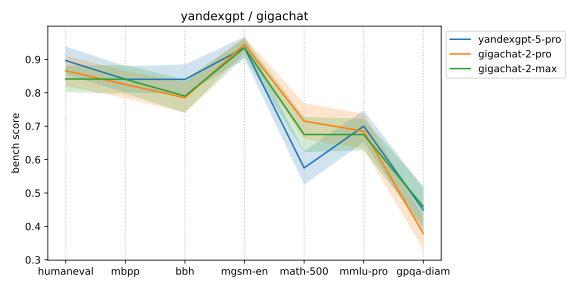
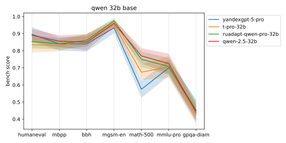
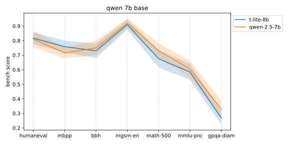
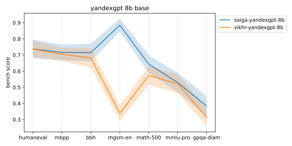

# simple-evals-ru

Репозиторий измеряет качество Yandexgpt, Gigachat, T-Pro, Saiga, Vikhr, Ruadapt на популярных англоязычных бенчмарках: MGSM, MATH, HumanEval, MBPP, BBH, MMLU-Pro, QPQA. В бенчмарках задания на математику, программирование и логику. Читать <a href="#samples">примеры заданий и ответы моделей</a>.

Репо сравнивает цену за миллион токенов для российских и популярных открытых мировых моделей: Qwen, Deepseek.

Репо похож на <a href="https://github.com/openai/simple-evals">simple-evals</a> от Openai, поддерживает только Intruct-модели, использует Zero-shot Chain-of-thought промпты.

> (!) Я запускаю российские LLM на англоязычных бенчмарках без перевода. Читать <a href="#eng_lang">аргументы, почему так норм делать</a>.

> (!) Я использую популярные открытые бенчмарки, ответы на них давно есть в интернете. Читать <a href="#open_test">аргументы, почему норм так делать</a>.

## Результаты

"$ / m tokens" - цена за миллион токенов, для Qwen и Deepseek цены с Openrouter. "avg" - средний скор.

<section id="scores-table"><table>
<tr>
<th></th>
<th>$ / m tokens</th>
<th>avg</th>
<th> humaneval </th>
<th> mbpp </th>
<th> bbh </th>
<th> mgsm&#8209;en </th>
<th> math&#8209;500 </th>
<th> mmlu&#8209;pro </th>
<th> gpqa&#8209;diam </th>
<th></th>
</tr>
<tr>
<th> gigachat&#8209;2&#8209;lite </th>
<td>$2.00</td>
<td>63.3±5.2%</td>
<td>69.5±5.8%</td>
<td>75.1±4.3%</td>
<td>67.0±5.5%</td>
<td>87.5±3.5%</td>
<td>60.0±5.2%</td>
<td>52.0±5.5%</td>
<td>31.8±6.3%</td>
<th> gigachat&#8209;2&#8209;lite </th>
</tr>
<tr>
<th> gigachat&#8209;2&#8209;pro </th>
<td>$15.00</td>
<td>74.3±4.5%</td>
<td>86.6±4.6%</td>
<td>82.5±4.1%</td>
<td>78.5±4.5%</td>
<td>94.5±2.2%</td>
<td>71.5±5.3%</td>
<td>68.5±5.3%</td>
<td>37.9±4.8%</td>
<th> gigachat&#8209;2&#8209;pro </th>
</tr>
<tr>
<th> gigachat&#8209;2&#8209;max </th>
<td>$19.50</td>
<td>74.5±4.7%</td>
<td>84.1±4.0%</td>
<td>84.0±4.3%</td>
<td>79.0±5.0%</td>
<td>93.5±2.7%</td>
<td>67.5±5.2%</td>
<td>67.5±4.8%</td>
<td>46.0±6.1%</td>
<th> gigachat&#8209;2&#8209;max </th>
</tr>
<tr>
<th> gigachat&#8209;lite </th>
<td>$2.00</td>
<td>43.1±5.3%</td>
<td>37.7±6.2%</td>
<td>51.0±5.3%</td>
<td>49.2±5.5%</td>
<td>71.0±4.8%</td>
<td>27.3±4.8%</td>
<td>36.0±5.3%</td>
<td>29.8±5.1%</td>
<th> gigachat&#8209;lite </th>
</tr>
<tr>
<th> gigachat&#8209;pro </th>
<td>$15.00</td>
<td>52.1±5.5%</td>
<td>45.1±5.8%</td>
<td>56.0±4.9%</td>
<td>64.0±5.5%</td>
<td>78.5±4.3%</td>
<td>42.5±6.3%</td>
<td>45.5±5.8%</td>
<td>33.3±5.8%</td>
<th> gigachat&#8209;pro </th>
</tr>
<tr>
<th> gigachat&#8209;max </th>
<td>$19.50</td>
<td>68.2±4.8%</td>
<td>72.0±5.8%</td>
<td>74.7±4.1%</td>
<td>75.5±4.8%</td>
<td>93.5±3.0%</td>
<td>55.0±5.0%</td>
<td>65.0±5.0%</td>
<td>41.4±5.3%</td>
<th> gigachat&#8209;max </th>
</tr>
<tr>
<th> yandexgpt&#8209;5&#8209;lite </th>
<td>$2.00</td>
<td>64.3±5.3%</td>
<td>70.1±5.8%</td>
<td>70.4±4.7%</td>
<td>69.5±5.2%</td>
<td>87.0±4.3%</td>
<td>63.0±5.5%</td>
<td>57.0±6.5%</td>
<td>32.8±5.1%</td>
<th> yandexgpt&#8209;5&#8209;lite </th>
</tr>
<tr>
<th> yandexgpt&#8209;5&#8209;pro </th>
<td>$12.00</td>
<td>74.8±4.7%</td>
<td>89.6±4.3%</td>
<td>84.0±3.9%</td>
<td>84.0±4.5%</td>
<td>93.5±3.3%</td>
<td>57.5±5.0%</td>
<td>70.0±4.7%</td>
<td>44.9±6.6%</td>
<th> yandexgpt&#8209;5&#8209;pro </th>
</tr>
<tr>
<th> yandexgpt&#8209;4&#8209;lite </th>
<td>$2.00</td>
<td>38.4±5.3%</td>
<td>26.8±5.8%</td>
<td>45.9±4.9%</td>
<td>55.0±6.3%</td>
<td>67.0±5.8%</td>
<td>16.0±4.0%</td>
<td>30.5±4.8%</td>
<td>27.8±5.1%</td>
<th> yandexgpt&#8209;4&#8209;lite </th>
</tr>
<tr>
<th> yandexgpt&#8209;4&#8209;pro </th>
<td>$12.00</td>
<td>51.3±5.3%</td>
<td>42.7±6.1%</td>
<td>53.7±5.3%</td>
<td>71.0±6.0%</td>
<td>78.5±4.5%</td>
<td>31.0±4.5%</td>
<td>48.5±5.0%</td>
<td>33.8±5.1%</td>
<th> yandexgpt&#8209;4&#8209;pro </th>
</tr>
<tr>
<th> t&#8209;lite&#8209;8b </th>
<td>selfhost</td>
<td>67.8±4.7%</td>
<td>81.7±4.0%</td>
<td>75.9±4.1%</td>
<td>73.0±5.0%</td>
<td>91.0±3.5%</td>
<td>67.5±6.0%</td>
<td>58.5±5.5%</td>
<td>26.8±4.5%</td>
<th> t&#8209;lite&#8209;8b </th>
</tr>
<tr>
<th> t&#8209;pro&#8209;32b </th>
<td>selfhost</td>
<td>75.5±4.4%</td>
<td>83.5±4.6%</td>
<td>82.9±3.1%</td>
<td>86.5±3.0%</td>
<td>95.0±2.2%</td>
<td>67.5±4.5%</td>
<td>70.5±6.3%</td>
<td>42.7±5.5%</td>
<th> t&#8209;pro&#8209;32b </th>
</tr>
<tr>
<th> saiga&#8209;yandexgpt&#8209;8b </th>
<td>selfhost</td>
<td>65.9±4.9%</td>
<td>73.8±5.5%</td>
<td>71.6±4.3%</td>
<td>71.5±5.5%</td>
<td>88.5±3.3%</td>
<td>64.3±5.1%</td>
<td>53.0±4.5%</td>
<td>38.4±5.6%</td>
<th> saiga&#8209;yandexgpt&#8209;8b </th>
</tr>
<tr>
<th> vikhr&#8209;yandexgpt&#8209;8b </th>
<td>selfhost</td>
<td>55.3±5.3%</td>
<td>73.8±5.2%</td>
<td>70.4±4.7%</td>
<td>68.2±5.6%</td>
<td>34.0±5.8%</td>
<td>57.3±5.5%</td>
<td>52.3±5.3%</td>
<td>31.3±5.1%</td>
<th> vikhr&#8209;yandexgpt&#8209;8b </th>
</tr>
<tr>
<th> ruadapt&#8209;qwen&#8209;32b </th>
<td>selfhost</td>
<td>78.2±4.3%</td>
<td>88.4±4.0%</td>
<td>88.3±2.4%</td>
<td>84.5±4.3%</td>
<td>96.5±2.0%</td>
<td>73.5±5.3%</td>
<td>70.4±5.1%</td>
<td>46.0±5.8%</td>
<th> ruadapt&#8209;qwen&#8209;32b </th>
</tr>
<tr>
<th> ruadapt&#8209;qwen&#8209;pro&#8209;32b </th>
<td>selfhost</td>
<td>77.7±4.0%</td>
<td>85.4±4.0%</td>
<td>84.0±3.1%</td>
<td>86.0±3.8%</td>
<td>97.5±1.5%</td>
<td>75.0±4.5%</td>
<td>70.9±5.0%</td>
<td>45.5±5.1%</td>
<th> ruadapt&#8209;qwen&#8209;pro&#8209;32b </th>
</tr>
<tr>
<th> qwen&#8209;2.5&#8209;7b </th>
<td>$0.04</td>
<td>69.4±5.0%</td>
<td>81.1±5.5%</td>
<td>71.6±3.9%</td>
<td>75.0±5.0%</td>
<td>92.0±3.3%</td>
<td>73.0±5.0%</td>
<td>60.5±5.8%</td>
<td>32.8±5.8%</td>
<th> qwen&#8209;2.5&#8209;7b </th>
</tr>
<tr>
<th> qwen&#8209;2.5&#8209;32b </th>
<td>$0.79</td>
<td>78.4±4.3%</td>
<td>89.0±3.7%</td>
<td>85.6±3.5%</td>
<td>85.0±4.8%</td>
<td>96.0±2.3%</td>
<td>77.0±4.5%</td>
<td>72.5±5.8%</td>
<td>43.9±4.9%</td>
<th> qwen&#8209;2.5&#8209;32b </th>
</tr>
<tr>
<th> qwen&#8209;2.5&#8209;72b </th>
<td>$0.29</td>
<td>79.9±4.2%</td>
<td>88.4±4.3%</td>
<td>87.2±3.5%</td>
<td>83.5±3.3%</td>
<td>96.5±1.8%</td>
<td>82.0±4.2%</td>
<td>74.0±5.0%</td>
<td>48.0±6.1%</td>
<th> qwen&#8209;2.5&#8209;72b </th>
</tr>
<tr>
<th> deepseek&#8209;v3 </th>
<td>$0.80</td>
<td>82.7±3.7%</td>
<td>90.9±3.4%</td>
<td>88.3±3.3%</td>
<td>89.0±3.5%</td>
<td>96.5±2.3%</td>
<td>81.3±3.8%</td>
<td>79.5±4.0%</td>
<td>53.5±5.1%</td>
<th> deepseek&#8209;v3 </th>
</tr>
</table>
</section>

<br/>

- Yandexgpt 5 Pro ~= Gigachat 2 Pro. Яндекс <a href="https://habr.com/ru/companies/yandex/articles/885218/">перешел на претрен от Qwen</a>. Сбер <a href="https://habr.com/ru/companies/sberdevices/articles/890552/">вроде бы держится</a>, но догнал Yandexgpt 5 Pro на англоязычных бенчах.
- Топовые модельки от Яндекса и Сбера на уровне опенсорсной T Pro на англоязычных бенчах. Lite версии на уровне Saiga Yandexgpt 8b.


<br/>

- Странно выглядит Gigachat 2 Max ~= Gigachat 2 Pro. Max похуже на MATH и Humaneval, получше на GPQA, результат <a href="https://habr.com/ru/companies/sberdevices/articles/890552/">совпадает с релизом Сбера</a>, см "MATH 500 FOUR SHOT", "humaneval", "GPQA_ZERO_SHOT_COT".
- У Yandexgpt что-то не так с MATH. <a href="https://habr.com/ru/companies/sberdevices/articles/890552/">В релизе Gigachat 2</a> Сбер тоже это заметил "При тестировании Yandex GPT 5 мы обнаружили расхождение в показателе Math с официальными результатами". Почитать <a href="reports/errors/math/17_yandexgpt_5_pro.md">ошибки Yandexgpt на MATH</a>.


<br/>

- Беда с ценой за токен. Yandexgpt 5 Pro в 15 раз дороже Qwen 2.5 32b Instruct, претрен одинаковый. Странновато что Qwen 32b дороже Qwen 72b, у Qwen 32b на Openrouter один провайдер, у Qwen 72b - 7.
- Отечественые модели догоняют китайские по скору, но не по цене.


<br/>

- В номинации "кто лучше затюнит Qwen 32b" побеждает Ruadapt. Ruadapt видимо меньше других отходит от оригинального Qwen 32b Instruct. Все скоры на англоязычных бенчах.
- У Yandexgpt что-то не так с MATH, см выше.
- T Pro иногда уходит в цикл на MATH и Humaneval, см <a href="reports/errors/math/20_t_pro.md">ошибки MATH</a> и <a href="reports/errors/humaneval/20_t_pro.md">ошибки Humaneval</a>.


<br/>

T Lite отличается от Qwen 7b на уровне шума, скоры на англоязычных бенчах.


<br/>

Saiga лучше затюнила Yandexgpt 8b, у Vikhr что-то сломалось на MGSM, см <a href="reports/errors/mgsm/22_vikhr.md">ошибки</a>, моделька решила не рассуждать. Yandexgpt 5 Lite отличается от Saiga в рамках погрешности.


<br/>

<a name="samples"></a>
Таблица со ссылками на примеры заданий и ответы моделей:
- "... ✓" - ссылка на страничку с примерами когда модель угадала ответ, "... ✗" - примеры где модель ошиблась. Полезно полистать ошибки, убедиться что оценщик правильно парсит ответы модели, случается что ответ правильный, но не по инструкции и модель получает штраф.
- Рядом с названием бенча число заданий, например, в MATH-500 500 заданий. Репо запускает не все задания, останавливается, когда закончились деньги на API или доверительные интервалы уже достаточно узкие.

<section id="results-table"><table>
<tr>
<th></th>
<th> humaneval <br/> 164 </th>
<th> mbpp <br/> 257 </th>
<th> bbh <br/> 1350 </th>
<th> mgsm&#8209;en <br/> 250 </th>
<th> math&#8209;500 <br/> 500 </th>
<th> mmlu&#8209;pro <br/> 1400 </th>
<th> gpqa&#8209;diam <br/> 198 </th>
<th></th>
</tr>
<tr>
<th> gigachat&#8209;2&#8209;lite </th>
<td>&nbsp;<a href="reports/correct/humaneval/25_gigachat_lite.md">&nbsp;114&nbsp;✓&nbsp;</a>&nbsp;/&nbsp;<a href="reports/errors/humaneval/25_gigachat_lite.md">&nbsp;50&nbsp;✗</a>&nbsp;</td>
<td>&nbsp;<a href="reports/correct/mbpp/25_gigachat_lite.md">&nbsp;193&nbsp;✓&nbsp;</a>&nbsp;/&nbsp;<a href="reports/errors/mbpp/25_gigachat_lite.md">&nbsp;64&nbsp;✗</a>&nbsp;</td>
<td>&nbsp;<a href="reports/correct/bbh/25_gigachat_lite.md">&nbsp;134&nbsp;✓&nbsp;</a>&nbsp;/&nbsp;<a href="reports/errors/bbh/25_gigachat_lite.md">&nbsp;66&nbsp;✗</a>&nbsp;</td>
<td>&nbsp;<a href="reports/correct/mgsm/25_gigachat_lite.md">&nbsp;175&nbsp;✓&nbsp;</a>&nbsp;/&nbsp;<a href="reports/errors/mgsm/25_gigachat_lite.md">&nbsp;25&nbsp;✗</a>&nbsp;</td>
<td>&nbsp;<a href="reports/correct/math/25_gigachat_lite.md">&nbsp;120&nbsp;✓&nbsp;</a>&nbsp;/&nbsp;<a href="reports/errors/math/25_gigachat_lite.md">&nbsp;80&nbsp;✗</a>&nbsp;</td>
<td>&nbsp;<a href="reports/correct/mmlu/25_gigachat_lite.md">&nbsp;104&nbsp;✓&nbsp;</a>&nbsp;/&nbsp;<a href="reports/errors/mmlu/25_gigachat_lite.md">&nbsp;96&nbsp;✗</a>&nbsp;</td>
<td>&nbsp;<a href="reports/correct/gpqa/25_gigachat_lite.md">&nbsp;63&nbsp;✓&nbsp;</a>&nbsp;/&nbsp;<a href="reports/errors/gpqa/25_gigachat_lite.md">&nbsp;135&nbsp;✗</a>&nbsp;</td>
<th> gigachat&#8209;2&#8209;lite </th>
</tr>
<tr>
<th> gigachat&#8209;2&#8209;pro </th>
<td>&nbsp;<a href="reports/correct/humaneval/26_gigachat_pro.md">&nbsp;142&nbsp;✓&nbsp;</a>&nbsp;/&nbsp;<a href="reports/errors/humaneval/26_gigachat_pro.md">&nbsp;22&nbsp;✗</a>&nbsp;</td>
<td>&nbsp;<a href="reports/correct/mbpp/26_gigachat_pro.md">&nbsp;212&nbsp;✓&nbsp;</a>&nbsp;/&nbsp;<a href="reports/errors/mbpp/26_gigachat_pro.md">&nbsp;45&nbsp;✗</a>&nbsp;</td>
<td>&nbsp;<a href="reports/correct/bbh/26_gigachat_pro.md">&nbsp;157&nbsp;✓&nbsp;</a>&nbsp;/&nbsp;<a href="reports/errors/bbh/26_gigachat_pro.md">&nbsp;43&nbsp;✗</a>&nbsp;</td>
<td>&nbsp;<a href="reports/correct/mgsm/26_gigachat_pro.md">&nbsp;189&nbsp;✓&nbsp;</a>&nbsp;/&nbsp;<a href="reports/errors/mgsm/26_gigachat_pro.md">&nbsp;11&nbsp;✗</a>&nbsp;</td>
<td>&nbsp;<a href="reports/correct/math/26_gigachat_pro.md">&nbsp;143&nbsp;✓&nbsp;</a>&nbsp;/&nbsp;<a href="reports/errors/math/26_gigachat_pro.md">&nbsp;57&nbsp;✗</a>&nbsp;</td>
<td>&nbsp;<a href="reports/correct/mmlu/26_gigachat_pro.md">&nbsp;137&nbsp;✓&nbsp;</a>&nbsp;/&nbsp;<a href="reports/errors/mmlu/26_gigachat_pro.md">&nbsp;63&nbsp;✗</a>&nbsp;</td>
<td>&nbsp;<a href="reports/correct/gpqa/26_gigachat_pro.md">&nbsp;75&nbsp;✓&nbsp;</a>&nbsp;/&nbsp;<a href="reports/errors/gpqa/26_gigachat_pro.md">&nbsp;123&nbsp;✗</a>&nbsp;</td>
<th> gigachat&#8209;2&#8209;pro </th>
</tr>
<tr>
<th> gigachat&#8209;2&#8209;max </th>
<td>&nbsp;<a href="reports/correct/humaneval/27_gigachat_max.md">&nbsp;138&nbsp;✓&nbsp;</a>&nbsp;/&nbsp;<a href="reports/errors/humaneval/27_gigachat_max.md">&nbsp;26&nbsp;✗</a>&nbsp;</td>
<td>&nbsp;<a href="reports/correct/mbpp/27_gigachat_max.md">&nbsp;216&nbsp;✓&nbsp;</a>&nbsp;/&nbsp;<a href="reports/errors/mbpp/27_gigachat_max.md">&nbsp;41&nbsp;✗</a>&nbsp;</td>
<td>&nbsp;<a href="reports/correct/bbh/27_gigachat_max.md">&nbsp;158&nbsp;✓&nbsp;</a>&nbsp;/&nbsp;<a href="reports/errors/bbh/27_gigachat_max.md">&nbsp;42&nbsp;✗</a>&nbsp;</td>
<td>&nbsp;<a href="reports/correct/mgsm/27_gigachat_max.md">&nbsp;187&nbsp;✓&nbsp;</a>&nbsp;/&nbsp;<a href="reports/errors/mgsm/27_gigachat_max.md">&nbsp;13&nbsp;✗</a>&nbsp;</td>
<td>&nbsp;<a href="reports/correct/math/27_gigachat_max.md">&nbsp;135&nbsp;✓&nbsp;</a>&nbsp;/&nbsp;<a href="reports/errors/math/27_gigachat_max.md">&nbsp;65&nbsp;✗</a>&nbsp;</td>
<td>&nbsp;<a href="reports/correct/mmlu/27_gigachat_max.md">&nbsp;135&nbsp;✓&nbsp;</a>&nbsp;/&nbsp;<a href="reports/errors/mmlu/27_gigachat_max.md">&nbsp;65&nbsp;✗</a>&nbsp;</td>
<td>&nbsp;<a href="reports/correct/gpqa/27_gigachat_max.md">&nbsp;91&nbsp;✓&nbsp;</a>&nbsp;/&nbsp;<a href="reports/errors/gpqa/27_gigachat_max.md">&nbsp;107&nbsp;✗</a>&nbsp;</td>
<th> gigachat&#8209;2&#8209;max </th>
</tr>
<tr>
<th> gigachat&#8209;lite </th>
<td>&nbsp;<a href="reports/correct/humaneval/08_gigachat_lite.md">&nbsp;61&nbsp;✓&nbsp;</a>&nbsp;/&nbsp;<a href="reports/errors/humaneval/08_gigachat_lite.md">&nbsp;101&nbsp;✗</a>&nbsp;</td>
<td>&nbsp;<a href="reports/correct/mbpp/08_gigachat_lite.md">&nbsp;131&nbsp;✓&nbsp;</a>&nbsp;/&nbsp;<a href="reports/errors/mbpp/08_gigachat_lite.md">&nbsp;126&nbsp;✗</a>&nbsp;</td>
<td>&nbsp;<a href="reports/correct/bbh/08_gigachat_lite.md">&nbsp;98&nbsp;✓&nbsp;</a>&nbsp;/&nbsp;<a href="reports/errors/bbh/08_gigachat_lite.md">&nbsp;101&nbsp;✗</a>&nbsp;</td>
<td>&nbsp;<a href="reports/correct/mgsm/08_gigachat_lite.md">&nbsp;142&nbsp;✓&nbsp;</a>&nbsp;/&nbsp;<a href="reports/errors/mgsm/08_gigachat_lite.md">&nbsp;58&nbsp;✗</a>&nbsp;</td>
<td>&nbsp;<a href="reports/correct/math/08_gigachat_lite.md">&nbsp;54&nbsp;✓&nbsp;</a>&nbsp;/&nbsp;<a href="reports/errors/math/08_gigachat_lite.md">&nbsp;144&nbsp;✗</a>&nbsp;</td>
<td>&nbsp;<a href="reports/correct/mmlu/08_gigachat_lite.md">&nbsp;72&nbsp;✓&nbsp;</a>&nbsp;/&nbsp;<a href="reports/errors/mmlu/08_gigachat_lite.md">&nbsp;128&nbsp;✗</a>&nbsp;</td>
<td>&nbsp;<a href="reports/correct/gpqa/08_gigachat_lite.md">&nbsp;59&nbsp;✓&nbsp;</a>&nbsp;/&nbsp;<a href="reports/errors/gpqa/08_gigachat_lite.md">&nbsp;139&nbsp;✗</a>&nbsp;</td>
<th> gigachat&#8209;lite </th>
</tr>
<tr>
<th> gigachat&#8209;pro </th>
<td>&nbsp;<a href="reports/correct/humaneval/12_gigachat_pro.md">&nbsp;74&nbsp;✓&nbsp;</a>&nbsp;/&nbsp;<a href="reports/errors/humaneval/12_gigachat_pro.md">&nbsp;90&nbsp;✗</a>&nbsp;</td>
<td>&nbsp;<a href="reports/correct/mbpp/12_gigachat_pro.md">&nbsp;144&nbsp;✓&nbsp;</a>&nbsp;/&nbsp;<a href="reports/errors/mbpp/12_gigachat_pro.md">&nbsp;113&nbsp;✗</a>&nbsp;</td>
<td>&nbsp;<a href="reports/correct/bbh/12_gigachat_pro.md">&nbsp;128&nbsp;✓&nbsp;</a>&nbsp;/&nbsp;<a href="reports/errors/bbh/12_gigachat_pro.md">&nbsp;72&nbsp;✗</a>&nbsp;</td>
<td>&nbsp;<a href="reports/correct/mgsm/12_gigachat_pro.md">&nbsp;157&nbsp;✓&nbsp;</a>&nbsp;/&nbsp;<a href="reports/errors/mgsm/12_gigachat_pro.md">&nbsp;43&nbsp;✗</a>&nbsp;</td>
<td>&nbsp;<a href="reports/correct/math/12_gigachat_pro.md">&nbsp;85&nbsp;✓&nbsp;</a>&nbsp;/&nbsp;<a href="reports/errors/math/12_gigachat_pro.md">&nbsp;115&nbsp;✗</a>&nbsp;</td>
<td>&nbsp;<a href="reports/correct/mmlu/12_gigachat_pro.md">&nbsp;91&nbsp;✓&nbsp;</a>&nbsp;/&nbsp;<a href="reports/errors/mmlu/12_gigachat_pro.md">&nbsp;109&nbsp;✗</a>&nbsp;</td>
<td>&nbsp;<a href="reports/correct/gpqa/12_gigachat_pro.md">&nbsp;66&nbsp;✓&nbsp;</a>&nbsp;/&nbsp;<a href="reports/errors/gpqa/12_gigachat_pro.md">&nbsp;132&nbsp;✗</a>&nbsp;</td>
<th> gigachat&#8209;pro </th>
</tr>
<tr>
<th> gigachat&#8209;max </th>
<td>&nbsp;<a href="reports/correct/humaneval/14_gigachat_max.md">&nbsp;118&nbsp;✓&nbsp;</a>&nbsp;/&nbsp;<a href="reports/errors/humaneval/14_gigachat_max.md">&nbsp;46&nbsp;✗</a>&nbsp;</td>
<td>&nbsp;<a href="reports/correct/mbpp/14_gigachat_max.md">&nbsp;192&nbsp;✓&nbsp;</a>&nbsp;/&nbsp;<a href="reports/errors/mbpp/14_gigachat_max.md">&nbsp;65&nbsp;✗</a>&nbsp;</td>
<td>&nbsp;<a href="reports/correct/bbh/14_gigachat_max.md">&nbsp;151&nbsp;✓&nbsp;</a>&nbsp;/&nbsp;<a href="reports/errors/bbh/14_gigachat_max.md">&nbsp;49&nbsp;✗</a>&nbsp;</td>
<td>&nbsp;<a href="reports/correct/mgsm/14_gigachat_max.md">&nbsp;187&nbsp;✓&nbsp;</a>&nbsp;/&nbsp;<a href="reports/errors/mgsm/14_gigachat_max.md">&nbsp;13&nbsp;✗</a>&nbsp;</td>
<td>&nbsp;<a href="reports/correct/math/14_gigachat_max.md">&nbsp;110&nbsp;✓&nbsp;</a>&nbsp;/&nbsp;<a href="reports/errors/math/14_gigachat_max.md">&nbsp;90&nbsp;✗</a>&nbsp;</td>
<td>&nbsp;<a href="reports/correct/mmlu/14_gigachat_max.md">&nbsp;130&nbsp;✓&nbsp;</a>&nbsp;/&nbsp;<a href="reports/errors/mmlu/14_gigachat_max.md">&nbsp;70&nbsp;✗</a>&nbsp;</td>
<td>&nbsp;<a href="reports/correct/gpqa/14_gigachat_max.md">&nbsp;82&nbsp;✓&nbsp;</a>&nbsp;/&nbsp;<a href="reports/errors/gpqa/14_gigachat_max.md">&nbsp;116&nbsp;✗</a>&nbsp;</td>
<th> gigachat&#8209;max </th>
</tr>
<tr>
<th> yandexgpt&#8209;5&#8209;lite </th>
<td>&nbsp;<a href="reports/correct/humaneval/30_yandexgpt_5_lite.md">&nbsp;115&nbsp;✓&nbsp;</a>&nbsp;/&nbsp;<a href="reports/errors/humaneval/30_yandexgpt_5_lite.md">&nbsp;49&nbsp;✗</a>&nbsp;</td>
<td>&nbsp;<a href="reports/correct/mbpp/30_yandexgpt_5_lite.md">&nbsp;181&nbsp;✓&nbsp;</a>&nbsp;/&nbsp;<a href="reports/errors/mbpp/30_yandexgpt_5_lite.md">&nbsp;76&nbsp;✗</a>&nbsp;</td>
<td>&nbsp;<a href="reports/correct/bbh/30_yandexgpt_5_lite.md">&nbsp;139&nbsp;✓&nbsp;</a>&nbsp;/&nbsp;<a href="reports/errors/bbh/30_yandexgpt_5_lite.md">&nbsp;61&nbsp;✗</a>&nbsp;</td>
<td>&nbsp;<a href="reports/correct/mgsm/30_yandexgpt_5_lite.md">&nbsp;174&nbsp;✓&nbsp;</a>&nbsp;/&nbsp;<a href="reports/errors/mgsm/30_yandexgpt_5_lite.md">&nbsp;26&nbsp;✗</a>&nbsp;</td>
<td>&nbsp;<a href="reports/correct/math/30_yandexgpt_5_lite.md">&nbsp;126&nbsp;✓&nbsp;</a>&nbsp;/&nbsp;<a href="reports/errors/math/30_yandexgpt_5_lite.md">&nbsp;74&nbsp;✗</a>&nbsp;</td>
<td>&nbsp;<a href="reports/correct/mmlu/30_yandexgpt_5_lite.md">&nbsp;114&nbsp;✓&nbsp;</a>&nbsp;/&nbsp;<a href="reports/errors/mmlu/30_yandexgpt_5_lite.md">&nbsp;86&nbsp;✗</a>&nbsp;</td>
<td>&nbsp;<a href="reports/correct/gpqa/30_yandexgpt_5_lite.md">&nbsp;65&nbsp;✓&nbsp;</a>&nbsp;/&nbsp;<a href="reports/errors/gpqa/30_yandexgpt_5_lite.md">&nbsp;133&nbsp;✗</a>&nbsp;</td>
<th> yandexgpt&#8209;5&#8209;lite </th>
</tr>
<tr>
<th> yandexgpt&#8209;5&#8209;pro </th>
<td>&nbsp;<a href="reports/correct/humaneval/17_yandexgpt_5_pro.md">&nbsp;147&nbsp;✓&nbsp;</a>&nbsp;/&nbsp;<a href="reports/errors/humaneval/17_yandexgpt_5_pro.md">&nbsp;17&nbsp;✗</a>&nbsp;</td>
<td>&nbsp;<a href="reports/correct/mbpp/17_yandexgpt_5_pro.md">&nbsp;216&nbsp;✓&nbsp;</a>&nbsp;/&nbsp;<a href="reports/errors/mbpp/17_yandexgpt_5_pro.md">&nbsp;41&nbsp;✗</a>&nbsp;</td>
<td>&nbsp;<a href="reports/correct/bbh/17_yandexgpt_5_pro.md">&nbsp;168&nbsp;✓&nbsp;</a>&nbsp;/&nbsp;<a href="reports/errors/bbh/17_yandexgpt_5_pro.md">&nbsp;32&nbsp;✗</a>&nbsp;</td>
<td>&nbsp;<a href="reports/correct/mgsm/17_yandexgpt_5_pro.md">&nbsp;187&nbsp;✓&nbsp;</a>&nbsp;/&nbsp;<a href="reports/errors/mgsm/17_yandexgpt_5_pro.md">&nbsp;13&nbsp;✗</a>&nbsp;</td>
<td>&nbsp;<a href="reports/correct/math/17_yandexgpt_5_pro.md">&nbsp;115&nbsp;✓&nbsp;</a>&nbsp;/&nbsp;<a href="reports/errors/math/17_yandexgpt_5_pro.md">&nbsp;85&nbsp;✗</a>&nbsp;</td>
<td>&nbsp;<a href="reports/correct/mmlu/17_yandexgpt_5_pro.md">&nbsp;140&nbsp;✓&nbsp;</a>&nbsp;/&nbsp;<a href="reports/errors/mmlu/17_yandexgpt_5_pro.md">&nbsp;60&nbsp;✗</a>&nbsp;</td>
<td>&nbsp;<a href="reports/correct/gpqa/17_yandexgpt_5_pro.md">&nbsp;89&nbsp;✓&nbsp;</a>&nbsp;/&nbsp;<a href="reports/errors/gpqa/17_yandexgpt_5_pro.md">&nbsp;109&nbsp;✗</a>&nbsp;</td>
<th> yandexgpt&#8209;5&#8209;pro </th>
</tr>
<tr>
<th> yandexgpt&#8209;4&#8209;lite </th>
<td>&nbsp;<a href="reports/correct/humaneval/07_yandexgpt_4_lite.md">&nbsp;44&nbsp;✓&nbsp;</a>&nbsp;/&nbsp;<a href="reports/errors/humaneval/07_yandexgpt_4_lite.md">&nbsp;120&nbsp;✗</a>&nbsp;</td>
<td>&nbsp;<a href="reports/correct/mbpp/07_yandexgpt_4_lite.md">&nbsp;118&nbsp;✓&nbsp;</a>&nbsp;/&nbsp;<a href="reports/errors/mbpp/07_yandexgpt_4_lite.md">&nbsp;139&nbsp;✗</a>&nbsp;</td>
<td>&nbsp;<a href="reports/correct/bbh/07_yandexgpt_4_lite.md">&nbsp;110&nbsp;✓&nbsp;</a>&nbsp;/&nbsp;<a href="reports/errors/bbh/07_yandexgpt_4_lite.md">&nbsp;90&nbsp;✗</a>&nbsp;</td>
<td>&nbsp;<a href="reports/correct/mgsm/07_yandexgpt_4_lite.md">&nbsp;134&nbsp;✓&nbsp;</a>&nbsp;/&nbsp;<a href="reports/errors/mgsm/07_yandexgpt_4_lite.md">&nbsp;66&nbsp;✗</a>&nbsp;</td>
<td>&nbsp;<a href="reports/correct/math/07_yandexgpt_4_lite.md">&nbsp;32&nbsp;✓&nbsp;</a>&nbsp;/&nbsp;<a href="reports/errors/math/07_yandexgpt_4_lite.md">&nbsp;168&nbsp;✗</a>&nbsp;</td>
<td>&nbsp;<a href="reports/correct/mmlu/07_yandexgpt_4_lite.md">&nbsp;61&nbsp;✓&nbsp;</a>&nbsp;/&nbsp;<a href="reports/errors/mmlu/07_yandexgpt_4_lite.md">&nbsp;139&nbsp;✗</a>&nbsp;</td>
<td>&nbsp;<a href="reports/correct/gpqa/07_yandexgpt_4_lite.md">&nbsp;55&nbsp;✓&nbsp;</a>&nbsp;/&nbsp;<a href="reports/errors/gpqa/07_yandexgpt_4_lite.md">&nbsp;143&nbsp;✗</a>&nbsp;</td>
<th> yandexgpt&#8209;4&#8209;lite </th>
</tr>
<tr>
<th> yandexgpt&#8209;4&#8209;pro </th>
<td>&nbsp;<a href="reports/correct/humaneval/11_yandexgpt_4_pro.md">&nbsp;70&nbsp;✓&nbsp;</a>&nbsp;/&nbsp;<a href="reports/errors/humaneval/11_yandexgpt_4_pro.md">&nbsp;94&nbsp;✗</a>&nbsp;</td>
<td>&nbsp;<a href="reports/correct/mbpp/11_yandexgpt_4_pro.md">&nbsp;138&nbsp;✓&nbsp;</a>&nbsp;/&nbsp;<a href="reports/errors/mbpp/11_yandexgpt_4_pro.md">&nbsp;119&nbsp;✗</a>&nbsp;</td>
<td>&nbsp;<a href="reports/correct/bbh/11_yandexgpt_4_pro.md">&nbsp;142&nbsp;✓&nbsp;</a>&nbsp;/&nbsp;<a href="reports/errors/bbh/11_yandexgpt_4_pro.md">&nbsp;58&nbsp;✗</a>&nbsp;</td>
<td>&nbsp;<a href="reports/correct/mgsm/11_yandexgpt_4_pro.md">&nbsp;157&nbsp;✓&nbsp;</a>&nbsp;/&nbsp;<a href="reports/errors/mgsm/11_yandexgpt_4_pro.md">&nbsp;43&nbsp;✗</a>&nbsp;</td>
<td>&nbsp;<a href="reports/correct/math/11_yandexgpt_4_pro.md">&nbsp;62&nbsp;✓&nbsp;</a>&nbsp;/&nbsp;<a href="reports/errors/math/11_yandexgpt_4_pro.md">&nbsp;138&nbsp;✗</a>&nbsp;</td>
<td>&nbsp;<a href="reports/correct/mmlu/11_yandexgpt_4_pro.md">&nbsp;97&nbsp;✓&nbsp;</a>&nbsp;/&nbsp;<a href="reports/errors/mmlu/11_yandexgpt_4_pro.md">&nbsp;103&nbsp;✗</a>&nbsp;</td>
<td>&nbsp;<a href="reports/correct/gpqa/11_yandexgpt_4_pro.md">&nbsp;67&nbsp;✓&nbsp;</a>&nbsp;/&nbsp;<a href="reports/errors/gpqa/11_yandexgpt_4_pro.md">&nbsp;131&nbsp;✗</a>&nbsp;</td>
<th> yandexgpt&#8209;4&#8209;pro </th>
</tr>
<tr>
<th> t&#8209;lite&#8209;8b </th>
<td>&nbsp;<a href="reports/correct/humaneval/19_t_lite.md">&nbsp;134&nbsp;✓&nbsp;</a>&nbsp;/&nbsp;<a href="reports/errors/humaneval/19_t_lite.md">&nbsp;30&nbsp;✗</a>&nbsp;</td>
<td>&nbsp;<a href="reports/correct/mbpp/19_t_lite.md">&nbsp;195&nbsp;✓&nbsp;</a>&nbsp;/&nbsp;<a href="reports/errors/mbpp/19_t_lite.md">&nbsp;62&nbsp;✗</a>&nbsp;</td>
<td>&nbsp;<a href="reports/correct/bbh/19_t_lite.md">&nbsp;146&nbsp;✓&nbsp;</a>&nbsp;/&nbsp;<a href="reports/errors/bbh/19_t_lite.md">&nbsp;54&nbsp;✗</a>&nbsp;</td>
<td>&nbsp;<a href="reports/correct/mgsm/19_t_lite.md">&nbsp;182&nbsp;✓&nbsp;</a>&nbsp;/&nbsp;<a href="reports/errors/mgsm/19_t_lite.md">&nbsp;18&nbsp;✗</a>&nbsp;</td>
<td>&nbsp;<a href="reports/correct/math/19_t_lite.md">&nbsp;135&nbsp;✓&nbsp;</a>&nbsp;/&nbsp;<a href="reports/errors/math/19_t_lite.md">&nbsp;65&nbsp;✗</a>&nbsp;</td>
<td>&nbsp;<a href="reports/correct/mmlu/19_t_lite.md">&nbsp;117&nbsp;✓&nbsp;</a>&nbsp;/&nbsp;<a href="reports/errors/mmlu/19_t_lite.md">&nbsp;83&nbsp;✗</a>&nbsp;</td>
<td>&nbsp;<a href="reports/correct/gpqa/19_t_lite.md">&nbsp;53&nbsp;✓&nbsp;</a>&nbsp;/&nbsp;<a href="reports/errors/gpqa/19_t_lite.md">&nbsp;145&nbsp;✗</a>&nbsp;</td>
<th> t&#8209;lite&#8209;8b </th>
</tr>
<tr>
<th> t&#8209;pro&#8209;32b </th>
<td>&nbsp;<a href="reports/correct/humaneval/20_t_pro.md">&nbsp;137&nbsp;✓&nbsp;</a>&nbsp;/&nbsp;<a href="reports/errors/humaneval/20_t_pro.md">&nbsp;27&nbsp;✗</a>&nbsp;</td>
<td>&nbsp;<a href="reports/correct/mbpp/20_t_pro.md">&nbsp;213&nbsp;✓&nbsp;</a>&nbsp;/&nbsp;<a href="reports/errors/mbpp/20_t_pro.md">&nbsp;44&nbsp;✗</a>&nbsp;</td>
<td>&nbsp;<a href="reports/correct/bbh/20_t_pro.md">&nbsp;173&nbsp;✓&nbsp;</a>&nbsp;/&nbsp;<a href="reports/errors/bbh/20_t_pro.md">&nbsp;27&nbsp;✗</a>&nbsp;</td>
<td>&nbsp;<a href="reports/correct/mgsm/20_t_pro.md">&nbsp;190&nbsp;✓&nbsp;</a>&nbsp;/&nbsp;<a href="reports/errors/mgsm/20_t_pro.md">&nbsp;10&nbsp;✗</a>&nbsp;</td>
<td>&nbsp;<a href="reports/correct/math/20_t_pro.md">&nbsp;135&nbsp;✓&nbsp;</a>&nbsp;/&nbsp;<a href="reports/errors/math/20_t_pro.md">&nbsp;65&nbsp;✗</a>&nbsp;</td>
<td>&nbsp;<a href="reports/correct/mmlu/20_t_pro.md">&nbsp;141&nbsp;✓&nbsp;</a>&nbsp;/&nbsp;<a href="reports/errors/mmlu/20_t_pro.md">&nbsp;59&nbsp;✗</a>&nbsp;</td>
<td>&nbsp;<a href="reports/correct/gpqa/20_t_pro.md">&nbsp;82&nbsp;✓&nbsp;</a>&nbsp;/&nbsp;<a href="reports/errors/gpqa/20_t_pro.md">&nbsp;110&nbsp;✗</a>&nbsp;</td>
<th> t&#8209;pro&#8209;32b </th>
</tr>
<tr>
<th> saiga&#8209;yandexgpt&#8209;8b </th>
<td>&nbsp;<a href="reports/correct/humaneval/21_saiga.md">&nbsp;121&nbsp;✓&nbsp;</a>&nbsp;/&nbsp;<a href="reports/errors/humaneval/21_saiga.md">&nbsp;43&nbsp;✗</a>&nbsp;</td>
<td>&nbsp;<a href="reports/correct/mbpp/21_saiga.md">&nbsp;184&nbsp;✓&nbsp;</a>&nbsp;/&nbsp;<a href="reports/errors/mbpp/21_saiga.md">&nbsp;73&nbsp;✗</a>&nbsp;</td>
<td>&nbsp;<a href="reports/correct/bbh/21_saiga.md">&nbsp;143&nbsp;✓&nbsp;</a>&nbsp;/&nbsp;<a href="reports/errors/bbh/21_saiga.md">&nbsp;57&nbsp;✗</a>&nbsp;</td>
<td>&nbsp;<a href="reports/correct/mgsm/21_saiga.md">&nbsp;177&nbsp;✓&nbsp;</a>&nbsp;/&nbsp;<a href="reports/errors/mgsm/21_saiga.md">&nbsp;23&nbsp;✗</a>&nbsp;</td>
<td>&nbsp;<a href="reports/correct/math/21_saiga.md">&nbsp;128&nbsp;✓&nbsp;</a>&nbsp;/&nbsp;<a href="reports/errors/math/21_saiga.md">&nbsp;71&nbsp;✗</a>&nbsp;</td>
<td>&nbsp;<a href="reports/correct/mmlu/21_saiga.md">&nbsp;106&nbsp;✓&nbsp;</a>&nbsp;/&nbsp;<a href="reports/errors/mmlu/21_saiga.md">&nbsp;94&nbsp;✗</a>&nbsp;</td>
<td>&nbsp;<a href="reports/correct/gpqa/21_saiga.md">&nbsp;76&nbsp;✓&nbsp;</a>&nbsp;/&nbsp;<a href="reports/errors/gpqa/21_saiga.md">&nbsp;122&nbsp;✗</a>&nbsp;</td>
<th> saiga&#8209;yandexgpt&#8209;8b </th>
</tr>
<tr>
<th> vikhr&#8209;yandexgpt&#8209;8b </th>
<td>&nbsp;<a href="reports/correct/humaneval/22_vikhr.md">&nbsp;121&nbsp;✓&nbsp;</a>&nbsp;/&nbsp;<a href="reports/errors/humaneval/22_vikhr.md">&nbsp;43&nbsp;✗</a>&nbsp;</td>
<td>&nbsp;<a href="reports/correct/mbpp/22_vikhr.md">&nbsp;181&nbsp;✓&nbsp;</a>&nbsp;/&nbsp;<a href="reports/errors/mbpp/22_vikhr.md">&nbsp;76&nbsp;✗</a>&nbsp;</td>
<td>&nbsp;<a href="reports/correct/bbh/22_vikhr.md">&nbsp;135&nbsp;✓&nbsp;</a>&nbsp;/&nbsp;<a href="reports/errors/bbh/22_vikhr.md">&nbsp;63&nbsp;✗</a>&nbsp;</td>
<td>&nbsp;<a href="reports/correct/mgsm/22_vikhr.md">&nbsp;68&nbsp;✓&nbsp;</a>&nbsp;/&nbsp;<a href="reports/errors/mgsm/22_vikhr.md">&nbsp;132&nbsp;✗</a>&nbsp;</td>
<td>&nbsp;<a href="reports/correct/math/22_vikhr.md">&nbsp;114&nbsp;✓&nbsp;</a>&nbsp;/&nbsp;<a href="reports/errors/math/22_vikhr.md">&nbsp;85&nbsp;✗</a>&nbsp;</td>
<td>&nbsp;<a href="reports/correct/mmlu/22_vikhr.md">&nbsp;104&nbsp;✓&nbsp;</a>&nbsp;/&nbsp;<a href="reports/errors/mmlu/22_vikhr.md">&nbsp;95&nbsp;✗</a>&nbsp;</td>
<td>&nbsp;<a href="reports/correct/gpqa/22_vikhr.md">&nbsp;62&nbsp;✓&nbsp;</a>&nbsp;/&nbsp;<a href="reports/errors/gpqa/22_vikhr.md">&nbsp;136&nbsp;✗</a>&nbsp;</td>
<th> vikhr&#8209;yandexgpt&#8209;8b </th>
</tr>
<tr>
<th> ruadapt&#8209;qwen&#8209;32b </th>
<td>&nbsp;<a href="reports/correct/humaneval/24_ruadapt.md">&nbsp;145&nbsp;✓&nbsp;</a>&nbsp;/&nbsp;<a href="reports/errors/humaneval/24_ruadapt.md">&nbsp;19&nbsp;✗</a>&nbsp;</td>
<td>&nbsp;<a href="reports/correct/mbpp/24_ruadapt.md">&nbsp;227&nbsp;✓&nbsp;</a>&nbsp;/&nbsp;<a href="reports/errors/mbpp/24_ruadapt.md">&nbsp;30&nbsp;✗</a>&nbsp;</td>
<td>&nbsp;<a href="reports/correct/bbh/24_ruadapt.md">&nbsp;169&nbsp;✓&nbsp;</a>&nbsp;/&nbsp;<a href="reports/errors/bbh/24_ruadapt.md">&nbsp;31&nbsp;✗</a>&nbsp;</td>
<td>&nbsp;<a href="reports/correct/mgsm/24_ruadapt.md">&nbsp;193&nbsp;✓&nbsp;</a>&nbsp;/&nbsp;<a href="reports/errors/mgsm/24_ruadapt.md">&nbsp;7&nbsp;✗</a>&nbsp;</td>
<td>&nbsp;<a href="reports/correct/math/24_ruadapt.md">&nbsp;147&nbsp;✓&nbsp;</a>&nbsp;/&nbsp;<a href="reports/errors/math/24_ruadapt.md">&nbsp;53&nbsp;✗</a>&nbsp;</td>
<td>&nbsp;<a href="reports/correct/mmlu/24_ruadapt.md">&nbsp;140&nbsp;✓&nbsp;</a>&nbsp;/&nbsp;<a href="reports/errors/mmlu/24_ruadapt.md">&nbsp;59&nbsp;✗</a>&nbsp;</td>
<td>&nbsp;<a href="reports/correct/gpqa/24_ruadapt.md">&nbsp;91&nbsp;✓&nbsp;</a>&nbsp;/&nbsp;<a href="reports/errors/gpqa/24_ruadapt.md">&nbsp;107&nbsp;✗</a>&nbsp;</td>
<th> ruadapt&#8209;qwen&#8209;32b </th>
</tr>
<tr>
<th> ruadapt&#8209;qwen&#8209;pro&#8209;32b </th>
<td>&nbsp;<a href="reports/correct/humaneval/29_ruadapt.md">&nbsp;140&nbsp;✓&nbsp;</a>&nbsp;/&nbsp;<a href="reports/errors/humaneval/29_ruadapt.md">&nbsp;24&nbsp;✗</a>&nbsp;</td>
<td>&nbsp;<a href="reports/correct/mbpp/29_ruadapt.md">&nbsp;216&nbsp;✓&nbsp;</a>&nbsp;/&nbsp;<a href="reports/errors/mbpp/29_ruadapt.md">&nbsp;41&nbsp;✗</a>&nbsp;</td>
<td>&nbsp;<a href="reports/correct/bbh/29_ruadapt.md">&nbsp;172&nbsp;✓&nbsp;</a>&nbsp;/&nbsp;<a href="reports/errors/bbh/29_ruadapt.md">&nbsp;28&nbsp;✗</a>&nbsp;</td>
<td>&nbsp;<a href="reports/correct/mgsm/29_ruadapt.md">&nbsp;195&nbsp;✓&nbsp;</a>&nbsp;/&nbsp;<a href="reports/errors/mgsm/29_ruadapt.md">&nbsp;5&nbsp;✗</a>&nbsp;</td>
<td>&nbsp;<a href="reports/correct/math/29_ruadapt.md">&nbsp;150&nbsp;✓&nbsp;</a>&nbsp;/&nbsp;<a href="reports/errors/math/29_ruadapt.md">&nbsp;50&nbsp;✗</a>&nbsp;</td>
<td>&nbsp;<a href="reports/correct/mmlu/29_ruadapt.md">&nbsp;141&nbsp;✓&nbsp;</a>&nbsp;/&nbsp;<a href="reports/errors/mmlu/29_ruadapt.md">&nbsp;58&nbsp;✗</a>&nbsp;</td>
<td>&nbsp;<a href="reports/correct/gpqa/29_ruadapt.md">&nbsp;90&nbsp;✓&nbsp;</a>&nbsp;/&nbsp;<a href="reports/errors/gpqa/29_ruadapt.md">&nbsp;108&nbsp;✗</a>&nbsp;</td>
<th> ruadapt&#8209;qwen&#8209;pro&#8209;32b </th>
</tr>
<tr>
<th> qwen&#8209;2.5&#8209;7b </th>
<td>&nbsp;<a href="reports/correct/humaneval/06_qwen_2_5_7b.md">&nbsp;133&nbsp;✓&nbsp;</a>&nbsp;/&nbsp;<a href="reports/errors/humaneval/06_qwen_2_5_7b.md">&nbsp;31&nbsp;✗</a>&nbsp;</td>
<td>&nbsp;<a href="reports/correct/mbpp/06_qwen_2_5_7b.md">&nbsp;184&nbsp;✓&nbsp;</a>&nbsp;/&nbsp;<a href="reports/errors/mbpp/06_qwen_2_5_7b.md">&nbsp;73&nbsp;✗</a>&nbsp;</td>
<td>&nbsp;<a href="reports/correct/bbh/06_qwen_2_5_7b.md">&nbsp;150&nbsp;✓&nbsp;</a>&nbsp;/&nbsp;<a href="reports/errors/bbh/06_qwen_2_5_7b.md">&nbsp;50&nbsp;✗</a>&nbsp;</td>
<td>&nbsp;<a href="reports/correct/mgsm/06_qwen_2_5_7b.md">&nbsp;184&nbsp;✓&nbsp;</a>&nbsp;/&nbsp;<a href="reports/errors/mgsm/06_qwen_2_5_7b.md">&nbsp;16&nbsp;✗</a>&nbsp;</td>
<td>&nbsp;<a href="reports/correct/math/06_qwen_2_5_7b.md">&nbsp;146&nbsp;✓&nbsp;</a>&nbsp;/&nbsp;<a href="reports/errors/math/06_qwen_2_5_7b.md">&nbsp;54&nbsp;✗</a>&nbsp;</td>
<td>&nbsp;<a href="reports/correct/mmlu/06_qwen_2_5_7b.md">&nbsp;121&nbsp;✓&nbsp;</a>&nbsp;/&nbsp;<a href="reports/errors/mmlu/06_qwen_2_5_7b.md">&nbsp;79&nbsp;✗</a>&nbsp;</td>
<td>&nbsp;<a href="reports/correct/gpqa/06_qwen_2_5_7b.md">&nbsp;65&nbsp;✓&nbsp;</a>&nbsp;/&nbsp;<a href="reports/errors/gpqa/06_qwen_2_5_7b.md">&nbsp;133&nbsp;✗</a>&nbsp;</td>
<th> qwen&#8209;2.5&#8209;7b </th>
</tr>
<tr>
<th> qwen&#8209;2.5&#8209;32b </th>
<td>&nbsp;<a href="reports/correct/humaneval/28_qwen_2_5_32b.md">&nbsp;146&nbsp;✓&nbsp;</a>&nbsp;/&nbsp;<a href="reports/errors/humaneval/28_qwen_2_5_32b.md">&nbsp;18&nbsp;✗</a>&nbsp;</td>
<td>&nbsp;<a href="reports/correct/mbpp/28_qwen_2_5_32b.md">&nbsp;220&nbsp;✓&nbsp;</a>&nbsp;/&nbsp;<a href="reports/errors/mbpp/28_qwen_2_5_32b.md">&nbsp;37&nbsp;✗</a>&nbsp;</td>
<td>&nbsp;<a href="reports/correct/bbh/28_qwen_2_5_32b.md">&nbsp;170&nbsp;✓&nbsp;</a>&nbsp;/&nbsp;<a href="reports/errors/bbh/28_qwen_2_5_32b.md">&nbsp;30&nbsp;✗</a>&nbsp;</td>
<td>&nbsp;<a href="reports/correct/mgsm/28_qwen_2_5_32b.md">&nbsp;192&nbsp;✓&nbsp;</a>&nbsp;/&nbsp;<a href="reports/errors/mgsm/28_qwen_2_5_32b.md">&nbsp;8&nbsp;✗</a>&nbsp;</td>
<td>&nbsp;<a href="reports/correct/math/28_qwen_2_5_32b.md">&nbsp;154&nbsp;✓&nbsp;</a>&nbsp;/&nbsp;<a href="reports/errors/math/28_qwen_2_5_32b.md">&nbsp;46&nbsp;✗</a>&nbsp;</td>
<td>&nbsp;<a href="reports/correct/mmlu/28_qwen_2_5_32b.md">&nbsp;145&nbsp;✓&nbsp;</a>&nbsp;/&nbsp;<a href="reports/errors/mmlu/28_qwen_2_5_32b.md">&nbsp;55&nbsp;✗</a>&nbsp;</td>
<td>&nbsp;<a href="reports/correct/gpqa/28_qwen_2_5_32b.md">&nbsp;87&nbsp;✓&nbsp;</a>&nbsp;/&nbsp;<a href="reports/errors/gpqa/28_qwen_2_5_32b.md">&nbsp;111&nbsp;✗</a>&nbsp;</td>
<th> qwen&#8209;2.5&#8209;32b </th>
</tr>
<tr>
<th> qwen&#8209;2.5&#8209;72b </th>
<td>&nbsp;<a href="reports/correct/humaneval/15_qwen_2_5_72b.md">&nbsp;145&nbsp;✓&nbsp;</a>&nbsp;/&nbsp;<a href="reports/errors/humaneval/15_qwen_2_5_72b.md">&nbsp;19&nbsp;✗</a>&nbsp;</td>
<td>&nbsp;<a href="reports/correct/mbpp/15_qwen_2_5_72b.md">&nbsp;224&nbsp;✓&nbsp;</a>&nbsp;/&nbsp;<a href="reports/errors/mbpp/15_qwen_2_5_72b.md">&nbsp;33&nbsp;✗</a>&nbsp;</td>
<td>&nbsp;<a href="reports/correct/bbh/15_qwen_2_5_72b.md">&nbsp;167&nbsp;✓&nbsp;</a>&nbsp;/&nbsp;<a href="reports/errors/bbh/15_qwen_2_5_72b.md">&nbsp;33&nbsp;✗</a>&nbsp;</td>
<td>&nbsp;<a href="reports/correct/mgsm/15_qwen_2_5_72b.md">&nbsp;193&nbsp;✓&nbsp;</a>&nbsp;/&nbsp;<a href="reports/errors/mgsm/15_qwen_2_5_72b.md">&nbsp;7&nbsp;✗</a>&nbsp;</td>
<td>&nbsp;<a href="reports/correct/math/15_qwen_2_5_72b.md">&nbsp;164&nbsp;✓&nbsp;</a>&nbsp;/&nbsp;<a href="reports/errors/math/15_qwen_2_5_72b.md">&nbsp;36&nbsp;✗</a>&nbsp;</td>
<td>&nbsp;<a href="reports/correct/mmlu/15_qwen_2_5_72b.md">&nbsp;148&nbsp;✓&nbsp;</a>&nbsp;/&nbsp;<a href="reports/errors/mmlu/15_qwen_2_5_72b.md">&nbsp;52&nbsp;✗</a>&nbsp;</td>
<td>&nbsp;<a href="reports/correct/gpqa/15_qwen_2_5_72b.md">&nbsp;95&nbsp;✓&nbsp;</a>&nbsp;/&nbsp;<a href="reports/errors/gpqa/15_qwen_2_5_72b.md">&nbsp;103&nbsp;✗</a>&nbsp;</td>
<th> qwen&#8209;2.5&#8209;72b </th>
</tr>
<tr>
<th> deepseek&#8209;v3 </th>
<td>&nbsp;<a href="reports/correct/humaneval/16_deepseek_v3.md">&nbsp;149&nbsp;✓&nbsp;</a>&nbsp;/&nbsp;<a href="reports/errors/humaneval/16_deepseek_v3.md">&nbsp;15&nbsp;✗</a>&nbsp;</td>
<td>&nbsp;<a href="reports/correct/mbpp/16_deepseek_v3.md">&nbsp;227&nbsp;✓&nbsp;</a>&nbsp;/&nbsp;<a href="reports/errors/mbpp/16_deepseek_v3.md">&nbsp;30&nbsp;✗</a>&nbsp;</td>
<td>&nbsp;<a href="reports/correct/bbh/16_deepseek_v3.md">&nbsp;178&nbsp;✓&nbsp;</a>&nbsp;/&nbsp;<a href="reports/errors/bbh/16_deepseek_v3.md">&nbsp;22&nbsp;✗</a>&nbsp;</td>
<td>&nbsp;<a href="reports/correct/mgsm/16_deepseek_v3.md">&nbsp;193&nbsp;✓&nbsp;</a>&nbsp;/&nbsp;<a href="reports/errors/mgsm/16_deepseek_v3.md">&nbsp;7&nbsp;✗</a>&nbsp;</td>
<td>&nbsp;<a href="reports/correct/math/16_deepseek_v3.md">&nbsp;161&nbsp;✓&nbsp;</a>&nbsp;/&nbsp;<a href="reports/errors/math/16_deepseek_v3.md">&nbsp;37&nbsp;✗</a>&nbsp;</td>
<td>&nbsp;<a href="reports/correct/mmlu/16_deepseek_v3.md">&nbsp;159&nbsp;✓&nbsp;</a>&nbsp;/&nbsp;<a href="reports/errors/mmlu/16_deepseek_v3.md">&nbsp;41&nbsp;✗</a>&nbsp;</td>
<td>&nbsp;<a href="reports/correct/gpqa/16_deepseek_v3.md">&nbsp;106&nbsp;✓&nbsp;</a>&nbsp;/&nbsp;<a href="reports/errors/gpqa/16_deepseek_v3.md">&nbsp;92&nbsp;✗</a>&nbsp;</td>
<th> deepseek&#8209;v3 </th>
</tr>
</table>
</section>

## Вопросы и ответы

<a name="eng_lang"></a>
### Почему вы запускаете российские LLM на англоязычных бенчмарках?

- Апелляция к авторитету. Топовые китайские Qwen и Deepseek, демонстрируют в первую очередь результаты на англоязычных бенчмарках и только во вторую на китайских: https://arxiv.org/abs/2309.16609, https://arxiv.org/abs/2412.19437.
- Яндекс и Сбер в 2025 году тоже публикуют результаты на англоязычных бенчах https://habr.com/ru/companies/yandex/articles/885218/ https://habr.com/ru/companies/sberdevices/articles/890552/.
- Репо использует англоязычные бенчи с заданиями про математику, программирование и логику, там нет заданий про знание языка и культуры. Читать <a href="#samples">примеры заданий</a>.
- Современные версии Yandexgpt и Gigachat способны понимать вопрос на английском и отвечать на английском. Читать <a href="#samples">примеры ответов</a>.

<a name="open_test"></a>
### А ничего что ответы на эти бенчмарки давно есть в интернете?

- Апелляция к авторитету. Авторы топовых LLM в 2024 году публикуют результаты на этих бенчах: https://arxiv.org/pdf/2407.21783, https://arxiv.org/pdf/2412.15115, https://arxiv.org/pdf/2412.19437
- Верю что разработчики в Сбере/Яндексе вычистили трейн. Бенчи супер популярные, Яндекс и Себр в релизах Yandexgpt 5 и Gigachat 2 публикую результаты на этих бенчах https://habr.com/ru/companies/yandex/articles/885218/, https://habr.com/ru/companies/sberdevices/articles/890552/, команды про них знают. За посление пару лет <a href="https://t.me/senior_augur/19">появилась масса способов проверить что тест был в трейне</a> даже для моделей за API. В интересах разработчиков приложить усилия, почистить.
- Я перемешал ответы в MMLU и GPQA 😎.

### Очень странно что у вас модель Х выше чем модель У, я каждый день пользуюсь моделью У и уверен что она лучше чем модель Х

Бенчмарки в этом репо тестируют узкий набор важных навыков: математика, код, логика. Читать <a href="#samples">примеры заданий</a>. Допускаю что частушки на русском Gigachat сочиняет лучше чем Llama.

## Заметки для разработки

<section id="cov-table"><table>
<tr>
<th></th>
<th> humaneval <br/> 164 </th>
<th> mbpp <br/> 257 </th>
<th> bbh <br/> 1350 </th>
<th> mgsm&#8209;en <br/> 250 </th>
<th> math&#8209;500 <br/> 500 </th>
<th> mmlu&#8209;pro <br/> 1400 </th>
<th> gpqa&#8209;diam <br/> 198 </th>
</tr>
<tr>
<th> gigachat&#8209;2&#8209;lite </th>
<td> 164&nbsp;/&nbsp;0.1$ </td>
<td> 257&nbsp;/&nbsp;0.1$ </td>
<td> 200&nbsp;/&nbsp;0.3$ </td>
<td> 200&nbsp;/&nbsp;0.1$ </td>
<td> 200&nbsp;/&nbsp;0.2$ </td>
<td> 200&nbsp;/&nbsp;0.2$ </td>
<td> 198&nbsp;/&nbsp;0.3$ </td>
</tr>
<tr>
<th> gigachat&#8209;2&#8209;pro </th>
<td> 164&nbsp;/&nbsp;0.6$ </td>
<td> 257&nbsp;/&nbsp;0.9$ </td>
<td> 200&nbsp;/&nbsp;2.9$ </td>
<td> 200&nbsp;/&nbsp;1.0$ </td>
<td> 200&nbsp;/&nbsp;1.9$ </td>
<td> 200&nbsp;/&nbsp;2.0$ </td>
<td> 198&nbsp;/&nbsp;2.3$ </td>
</tr>
<tr>
<th> gigachat&#8209;2&#8209;max </th>
<td> 164&nbsp;/&nbsp;0.9$ </td>
<td> 257&nbsp;/&nbsp;1.1$ </td>
<td> 200&nbsp;/&nbsp;4.6$ </td>
<td> 200&nbsp;/&nbsp;1.3$ </td>
<td> 200&nbsp;/&nbsp;2.2$ </td>
<td> 200&nbsp;/&nbsp;2.1$ </td>
<td> 198&nbsp;/&nbsp;2.7$ </td>
</tr>
<tr>
<th> gigachat&#8209;lite </th>
<td> 162&nbsp;/&nbsp;0.1$ </td>
<td> 257&nbsp;/&nbsp;0.2$ </td>
<td> 199&nbsp;/&nbsp;0.5$ </td>
<td> 200&nbsp;/&nbsp;0.2$ </td>
<td> 198&nbsp;/&nbsp;0.3$ </td>
<td> 200&nbsp;/&nbsp;0.4$ </td>
<td> 198&nbsp;/&nbsp;0.4$ </td>
</tr>
<tr>
<th> gigachat&#8209;pro </th>
<td> 164&nbsp;/&nbsp;0.8$ </td>
<td> 257&nbsp;/&nbsp;1.0$ </td>
<td> 200&nbsp;/&nbsp;3.8$ </td>
<td> 200&nbsp;/&nbsp;1.2$ </td>
<td> 200&nbsp;/&nbsp;2.0$ </td>
<td> 200&nbsp;/&nbsp;2.5$ </td>
<td> 198&nbsp;/&nbsp;2.7$ </td>
</tr>
<tr>
<th> gigachat&#8209;max </th>
<td> 164&nbsp;/&nbsp;0.8$ </td>
<td> 257&nbsp;/&nbsp;1.2$ </td>
<td> 200&nbsp;/&nbsp;4.3$ </td>
<td> 200&nbsp;/&nbsp;1.0$ </td>
<td> 200&nbsp;/&nbsp;2.2$ </td>
<td> 200&nbsp;/&nbsp;2.4$ </td>
<td> 198&nbsp;/&nbsp;2.8$ </td>
</tr>
<tr>
<th> yandexgpt&#8209;5&#8209;lite </th>
<td> 164&nbsp;/&nbsp;0.1$ </td>
<td> 257&nbsp;/&nbsp;0.1$ </td>
<td> 200&nbsp;/&nbsp;0.5$ </td>
<td> 200&nbsp;/&nbsp;0.1$ </td>
<td> 200&nbsp;/&nbsp;0.2$ </td>
<td> 200&nbsp;/&nbsp;0.2$ </td>
<td> 198&nbsp;/&nbsp;0.2$ </td>
</tr>
<tr>
<th> yandexgpt&#8209;5&#8209;pro </th>
<td> 164&nbsp;/&nbsp;0.6$ </td>
<td> 257&nbsp;/&nbsp;0.7$ </td>
<td> 200&nbsp;/&nbsp;2.8$ </td>
<td> 200&nbsp;/&nbsp;0.6$ </td>
<td> 200&nbsp;/&nbsp;1.1$ </td>
<td> 200&nbsp;/&nbsp;1.2$ </td>
<td> 198&nbsp;/&nbsp;1.5$ </td>
</tr>
<tr>
<th> yandexgpt&#8209;4&#8209;lite </th>
<td> 164&nbsp;/&nbsp;0.1$ </td>
<td> 257&nbsp;/&nbsp;0.1$ </td>
<td> 200&nbsp;/&nbsp;0.5$ </td>
<td> 200&nbsp;/&nbsp;0.1$ </td>
<td> 200&nbsp;/&nbsp;0.1$ </td>
<td> 200&nbsp;/&nbsp;0.1$ </td>
<td> 198&nbsp;/&nbsp;0.2$ </td>
</tr>
<tr>
<th> yandexgpt&#8209;4&#8209;pro </th>
<td> 164&nbsp;/&nbsp;0.6$ </td>
<td> 257&nbsp;/&nbsp;0.8$ </td>
<td> 200&nbsp;/&nbsp;2.8$ </td>
<td> 200&nbsp;/&nbsp;0.6$ </td>
<td> 200&nbsp;/&nbsp;1.1$ </td>
<td> 200&nbsp;/&nbsp;1.0$ </td>
<td> 198&nbsp;/&nbsp;1.2$ </td>
</tr>
<tr>
<th> t&#8209;lite&#8209;8b </th>
<td> 164&nbsp;/&nbsp;0.0$ </td>
<td> 257&nbsp;/&nbsp;0.0$ </td>
<td> 200&nbsp;/&nbsp;0.0$ </td>
<td> 200&nbsp;/&nbsp;0.0$ </td>
<td> 200&nbsp;/&nbsp;0.0$ </td>
<td> 200&nbsp;/&nbsp;0.0$ </td>
<td> 198&nbsp;/&nbsp;0.0$ </td>
</tr>
<tr>
<th> t&#8209;pro&#8209;32b </th>
<td> 164&nbsp;/&nbsp;0.0$ </td>
<td> 257&nbsp;/&nbsp;0.0$ </td>
<td> 200&nbsp;/&nbsp;0.0$ </td>
<td> 200&nbsp;/&nbsp;0.0$ </td>
<td> 200&nbsp;/&nbsp;0.0$ </td>
<td> 200&nbsp;/&nbsp;0.0$ </td>
<td> 192&nbsp;/&nbsp;0.0$ </td>
</tr>
<tr>
<th> saiga&#8209;yandexgpt&#8209;8b </th>
<td> 164&nbsp;/&nbsp;0.0$ </td>
<td> 257&nbsp;/&nbsp;0.0$ </td>
<td> 200&nbsp;/&nbsp;0.0$ </td>
<td> 200&nbsp;/&nbsp;0.0$ </td>
<td> 199&nbsp;/&nbsp;0.0$ </td>
<td> 200&nbsp;/&nbsp;0.0$ </td>
<td> 198&nbsp;/&nbsp;0.0$ </td>
</tr>
<tr>
<th> vikhr&#8209;yandexgpt&#8209;8b </th>
<td> 164&nbsp;/&nbsp;0.0$ </td>
<td> 257&nbsp;/&nbsp;0.0$ </td>
<td> 198&nbsp;/&nbsp;0.0$ </td>
<td> 200&nbsp;/&nbsp;0.0$ </td>
<td> 199&nbsp;/&nbsp;0.0$ </td>
<td> 199&nbsp;/&nbsp;0.0$ </td>
<td> 198&nbsp;/&nbsp;0.0$ </td>
</tr>
<tr>
<th> ruadapt&#8209;qwen&#8209;32b </th>
<td> 164&nbsp;/&nbsp;0.0$ </td>
<td> 257&nbsp;/&nbsp;0.0$ </td>
<td> 200&nbsp;/&nbsp;0.0$ </td>
<td> 200&nbsp;/&nbsp;0.0$ </td>
<td> 200&nbsp;/&nbsp;0.0$ </td>
<td> 199&nbsp;/&nbsp;0.0$ </td>
<td> 198&nbsp;/&nbsp;0.0$ </td>
</tr>
<tr>
<th> ruadapt&#8209;qwen&#8209;pro&#8209;32b </th>
<td> 164&nbsp;/&nbsp;0.0$ </td>
<td> 257&nbsp;/&nbsp;0.0$ </td>
<td> 200&nbsp;/&nbsp;0.0$ </td>
<td> 200&nbsp;/&nbsp;0.0$ </td>
<td> 200&nbsp;/&nbsp;0.0$ </td>
<td> 199&nbsp;/&nbsp;0.0$ </td>
<td> 198&nbsp;/&nbsp;0.0$ </td>
</tr>
<tr>
<th> qwen&#8209;2.5&#8209;7b </th>
<td> 164&nbsp;/&nbsp;0.0$ </td>
<td> 257&nbsp;/&nbsp;0.0$ </td>
<td> 200&nbsp;/&nbsp;0.0$ </td>
<td> 200&nbsp;/&nbsp;0.0$ </td>
<td> 200&nbsp;/&nbsp;0.0$ </td>
<td> 200&nbsp;/&nbsp;0.0$ </td>
<td> 198&nbsp;/&nbsp;0.0$ </td>
</tr>
<tr>
<th> qwen&#8209;2.5&#8209;32b </th>
<td> 164&nbsp;/&nbsp;0.0$ </td>
<td> 257&nbsp;/&nbsp;0.1$ </td>
<td> 200&nbsp;/&nbsp;0.2$ </td>
<td> 200&nbsp;/&nbsp;0.1$ </td>
<td> 200&nbsp;/&nbsp;0.1$ </td>
<td> 200&nbsp;/&nbsp;0.1$ </td>
<td> 198&nbsp;/&nbsp;0.1$ </td>
</tr>
<tr>
<th> qwen&#8209;2.5&#8209;72b </th>
<td> 164&nbsp;/&nbsp;0.0$ </td>
<td> 257&nbsp;/&nbsp;0.0$ </td>
<td> 200&nbsp;/&nbsp;0.0$ </td>
<td> 200&nbsp;/&nbsp;0.0$ </td>
<td> 200&nbsp;/&nbsp;0.1$ </td>
<td> 200&nbsp;/&nbsp;0.1$ </td>
<td> 198&nbsp;/&nbsp;0.1$ </td>
</tr>
<tr>
<th> deepseek&#8209;v3 </th>
<td> 164&nbsp;/&nbsp;0.0$ </td>
<td> 257&nbsp;/&nbsp;0.0$ </td>
<td> 200&nbsp;/&nbsp;0.1$ </td>
<td> 200&nbsp;/&nbsp;0.0$ </td>
<td> 198&nbsp;/&nbsp;0.1$ </td>
<td> 200&nbsp;/&nbsp;0.1$ </td>
<td> 198&nbsp;/&nbsp;0.2$ </td>
</tr>
</table>
</section>

```
mkdir -p data/cache/mgsm
curl -o data/cache/mgsm/mgsm_en.tsv https://openaipublic.blob.core.windows.net/simple-evals/mgsm_en.tsv
uv run scripts/prep_benches.py -b mgsm
head -3 data/benches/mgsm.jsonl | jq .

mkdir -p data/cache/math
curl -o data/cache/math/math_test.csv https://openaipublic.blob.core.windows.net/simple-evals/math_test.csv
curl -o data/cache/math/math_500_test.csv https://openaipublic.blob.core.windows.net/simple-evals/math_500_test.csv
uv run scripts/prep_benches.py -b math
head -3 data/benches/math.jsonl | jq .

mkdir -p data/cache/humaneval
curl -L -o data/cache/humaneval/HumanEval.jsonl.gz https://github.com/openai/human-eval/raw/refs/heads/master/data/HumanEval.jsonl.gz
gunzip data/cache/humaneval/HumanEval.jsonl.gz
uv run scripts/prep_benches.py humaneval
head -3 data/benches/humaneval.jsonl | jq .

mkdir -p data/cache/mmlu
curl -L -o data/cache/mmlu/test-00000-of-00001.parquet https://huggingface.co/datasets/TIGER-Lab/MMLU-Pro/resolve/main/data/test-00000-of-00001.parquet
uv run scripts/prep_benches.py -b mmlu
head -3 data/benches/mmlu.jsonl | jq .

mkdir -p data/cache/simpleqa
curl -L -o data/cache/simpleqa/simple_qa_test_set.csv https://openaipublic.blob.core.windows.net/simple-evals/simple_qa_test_set.csv 
uv run scripts/prep_benches.py -b simpleqa
head -3 data/benches/simpleqa.jsonl | jq .

mkdir -p data/cache/bbh
curl -L -o data/cache/bbh/main.zip https://github.com/suzgunmirac/BIG-Bench-Hard/archive/refs/heads/main.zip
unzip -d data/cache/bbh data/cache/bbh/main.zip
uv run scripts/prep_benches.py -b bbh
head -3 data/benches/bbh.jsonl | jq .

mkdir -p data/cache/gpqa
login go to https://huggingface.co/datasets/Idavidrein/gpqa/raw/main/gpqa_diamond.csv
save to data/cache/gpqa/gpqa_diamond.csv
uv run scripts/prep_benches.py -b gpqa
head -3 data/benches/gpqa.jsonl | jq .

mkdir -p data/cache/mbpp
curl -L -o data/cache/mbpp/test-00000-of-00001.parquet https://huggingface.co/datasets/google-research-datasets/mbpp/resolve/main/sanitized/test-00000-of-00001.parquet
uv run scripts/prep_benches.py -b mbpp
head -3 data/benches/mbpp.jsonl | jq .

```

```
uv run scripts/run_benches.py -k 1
uv run scripts/run_benches.py -k 100 -b{mgsm,math,mmlu,bbh}
uv run scripts/run_benches.py -k 200 -m{07_yandexgpt_4_lite,08_gigachat_lite,10_llama_3_1_8b,11_yandexgpt_4_pro,12_gigachat_pro,13_llama_3_3_70b,14_gigachat_max}

uv run scripts/run_benches.py -k 500 -m{06_qwen_2_5_7b,28_qwen_2_5_32b,15_qwen_2_5_72b,16_deepseek_v3} -b{gpqa,mbpp}

uv run scripts/run_benches.py -m{19_t_lite,21_saiga,22_vikhr} -b{gpqa,mbpp}
uv run scripts/run_benches.py -m 30_yandexgpt_5_lite -k 200
uv run scripts/run_benches.py -m 30_yandexgpt_5_lite -b mbpp
```

```
rm -r reports
uv run scripts/report_results.py
find errors -name '*.md' | grep giga | xargs cat | grip -

rm -r reports
uv run scripts/report_results.py
uv run scripts/stats_update.py
uv run scripts/readme_update.py

uv run scripts/plot_scatter_cost_score1.py
uv run scripts/plot_scatter_cost_score2.py
uv run scripts/plot_parallel.py
```

```
export NO_COLOR=1
export PATH=/opt/homebrew/bin:$PATH
PROJ=~/proj/simple-evals-ru
. $PROJ/.envrc
uv run ruff check $(find $PROJ/simple $PROJ/scripts $PROJ/tests -name '*.py')
uv run pytest -s $PROJ/tests/*.py
```

```
H100 / A100, 80+ gb VRAM, spot
vllm/vllm-openai:v0.7.3
HF_TOKEN
TCP port 8000

--model IlyaGusev/saiga_yandexgpt_8b --revision de2903f --dtype bfloat16 --max-model-len 8192 --gpu-memory-utilization 0.95 --host 0.0.0.0 --port 8000
volume 25 Gb

--model Vikhrmodels/Vikhr-YandexGPT-5-Lite-8B-it --revision e99a6f2 --dtype bfloat16 --max-model-len 8192 --gpu-memory-utilization 0.95 --host 0.0.0.0 --port 8000
volume 20 Gb

--model t-tech/T-lite-it-1.0 --revision fbabc76 --dtype bfloat16 --max-model-len 8192 --gpu-memory-utilization 0.95 --host 0.0.0.0 --port 8000
volume 20 Gb

--model t-tech/T-pro-it-1.0 --revision f88b5bf --dtype bfloat16 --max-model-len 8192 --gpu-memory-utilization 0.95 --host 0.0.0.0 --port 8000
volume 75 Gb

--model msu-rcc-lair/RuadaptQwen2.5-32B-Instruct --revision a8e35ac --dtype bfloat16 --max-model-len 8192 --gpu-memory-utilization 0.95 --host 0.0.0.0 --port 8000
volume 75 Gb

--model RefalMachine/RuadaptQwen2.5-32B-Pro-Beta --revision 719fcd9 --dtype bfloat16 --max-model-len 8192 --gpu-memory-utilization 0.95 --host 0.0.0.0 --port 8000
volume 75 Gb

```
